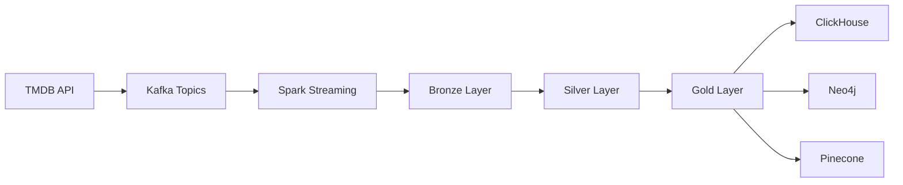

## Architecture Overview

The Entertainment Data Platform implements a **Medallion Architecture** (Bronze → Silver → Gold) that transforms raw streaming data into high-quality, analysis-ready datasets across multiple specialized storage systems.



## Data Collection & Simulation

### Collector Module

The collector module contains crawler scripts that extract data from the TMDB API for Movies, TV Series, and People entities.

<Info>
**Dataset Availability**: Pre-collected datasets are available on [Kaggle](https://www.kaggle.com/datasets/khoatm2k4/tmdb-craw-dataset) and [HuggingFace](https://huggingface.co/datasets/tmkhoa/tmdb-craw-dataset/tree/main).
</Info>

### Ingestion Module

The ingestion module simulates real-world streaming traffic by loading shuffled records with labels (`old`, `new`, `change`) to Kafka topics. This mimics late-arriving data and updates to test system resilience.

**Key Design Principles:**

- **Mixed Data Types**: Combines `movie`, `tv_series`, and `person` records in a single stream
- **State Simulation**: Labels records as `new`, `change`, or `old` to simulate real-world update patterns
- **Random Shuffling**: Randomizes record order to test out-of-order data handling

#### Ingestion Flow

<Steps>
  <Step title="Load Data">
    Read raw JSONL files from the `ingestion/data/` directory across all data types and labels
  </Step>
  <Step title="Enrich Records">
    Add ingestion metadata and update processing timestamps
  </Step>
  <Step title="Publish to Kafka">
    Serialize events as JSON and send to appropriate Kafka topics based on data type
  </Step>
</Steps>

**Code Location**: `src/ingestion/main.py:12`

```python
for record, data_type, data_label in iter_full(data_root_path):
    # Enrich record
    enriched_record = enrich_record(record, data_type, data_label)
    
    # Send record to kafka
    producer.send(topics[data_type], enriched_record)
```

## Stream Processing (Bronze Layer)

### Spark Structured Streaming

The stream processor consumes events from Kafka using Spark Structured Streaming and performs "Lightweight Parsing" to validate critical fields.

<Note>
**Performance Strategy**: To ensure high throughput and handle unstable schemas, the system only validates critical fields during streaming. Full schema parsing happens in the batch layer.
</Note>

### Error Handling with Dead Letter Queue

Records that fail validation are routed to a **Dead Letter Storage** (DLQ) instead of halting the pipeline, ensuring 24/7 availability.

**DLQ Guarantees:**

- **No Data Loss**: Failed records are stored, not dropped
- **Easier Debugging**: Invalid records can be analyzed separately
- **Stable Operations**: Bad data doesn't break the pipeline

### Delta Lake Storage

All events are saved into **Delta Lake** on MinIO (Bronze Layer) for long-term auditing and reprocessing capabilities.

**Code Location**: `src/stream_processor/main.py:22`

```python
# Create Spark session with Delta Lake support
builder = (
    SparkSession.builder \
        .appName("KafkaStreamToDelta") \
        .config("spark.sql.extensions", "io.delta.sql.DeltaSparkSessionExtension") \
        .config("spark.sql.catalog.spark_catalog", "org.apache.spark.sql.delta.catalog.DeltaCatalog") \
        .config("spark.databricks.delta.properties.defaults.enableChangeDataFeed", "true")
)
```

<Warning>
Change Data Feed must be enabled on Delta tables to support the change-tracking mechanism used in batch processing.
</Warning>

## Batch Jobs & Refinement (Silver & Gold Layers)

Batch jobs are orchestrated by **Apache Airflow** and execute the following pipeline stages:

### 1. Bronze → Silver: Deduplication

Handles chaotic streaming data using Delta Lake's `upsert` (Merge) operation based on timestamps.

**Key Operations:**

- **Full Schema Parsing**: Apply complete schema validation (unlike the lightweight streaming validation)
- **Deduplication**: Keep only the latest record based on timestamp
- **Change Tracking**: Detect changes in relationship fields (casts/crews) and embedding fields

**Code Location**: `src/batch_jobs/pipelines/bronze_silver/minio_to_minio.py:19`

```python
def run_dedup_timestamp():
    # Get batch version from Redis
    version_key = f"{settings.storage.redis.keys.dedup_batch_version}_{data_type}"
    last_version = redis_client.get(version_key)
    
    # Read changes using Change Data Feed
    from_df = delta_minio_reader.read_table_cdf(
        target_path=from_path, 
        start_version=int(last_version), 
        end_version=current_version
    )
    
    # Upsert with timestamp deduplication
    upsert_latest(spark, from_df, data_type, to_path, 
                  key_columns=["data_type", "id_of_data_type"], 
                  ts_column="timestamp")
```

<Tip>
Redis tracks the last processed Delta Lake version for incremental processing, reducing compute overhead.
</Tip>

### 2. Silver → ClickHouse: OLAP Transformation

Normalizes data into structured tables in ClickHouse (Gold Layer) for fast analytics.

**Transformations:**

- **Denormalization**: Flatten nested structures for query performance
- **Table Creation**: Separate tables for Movies, TV Series, People, Casts, and Crews
- **Optimized Storage**: ClickHouse's columnar format for analytical queries

**Pipeline**: `src/batch_jobs/pipelines/silver_silver/minio_to_clickhouse.py`

### 3. ClickHouse → Neo4j: Graph Sync

Syncs relationship data to Neo4j for knowledge graph queries.

**Optimization Strategy:**

- **Change Detection**: Only update records where relationship fields have changed
- **Efficient Writes**: Batch operations to reduce Neo4j write latency
- **Graph Relationships**: Create edges between Movies/TV Series and Cast/Crew members

**Pipeline**: `src/batch_jobs/pipelines/silver_gold/clickhouse_to_neo4j.py`

### 4. ClickHouse → Pinecone: Vector Sync

Generates embeddings and stores them in Pinecone for semantic search.

**Process Flow:**

<Steps>
  <Step title="Filter Changed Records">
    Query ClickHouse for records where embedding-related fields have changed
  </Step>
  <Step title="Generate Embeddings">
    Use sentence-transformers to create vector embeddings from text content
  </Step>
  <Step title="Upsert to Pinecone">
    Update or insert vectors in Pinecone index
  </Step>
</Steps>

**Pipeline**: `src/batch_jobs/pipelines/silver_gold/clickhouse_to_pinecone.py`

<Info>
The change-tracking mechanism drastically reduces Pinecone API costs by only updating embeddings when content actually changes.
</Info>

## Component Interactions

### Storage Layer

**MinIO** serves as the S3-compatible object storage for Delta Lake tables:

- **Bronze Tables**: Raw immutable data from Kafka
- **Silver Tables**: Deduplicated, validated, single source of truth
- **Checkpoints**: Spark streaming checkpoints for fault tolerance
- **DLQ Storage**: Failed records for debugging

### Analytical Layer

**ClickHouse** provides OLAP capabilities:

- Sub-second query response times
- Columnar storage optimization
- Horizontal scalability
- SQL interface for analytics

### Graph Layer

**Neo4j** enables relationship exploration:

- Deep-link traversal between entities
- Cypher query language
- Graph algorithms (shortest path, centrality, etc.)
- Visual graph exploration

### Vector Layer

**Pinecone** powers semantic search and RAG:

- High-dimensional vector storage
- Fast nearest-neighbor search
- Scalable vector indexing
- Metadata filtering

## Orchestration with Airflow

Apache Airflow orchestrates the batch pipeline execution:

**DAG Structure**: `src/batch_jobs/dags/batch_jobs.py`

- **Task 1**: Bronze to Silver deduplication
- **Task 2**: Silver to ClickHouse transformation
- **Task 3**: ClickHouse to Neo4j sync (depends on Task 2)
- **Task 4**: ClickHouse to Pinecone sync (depends on Task 2)

<Note>
Tasks 3 and 4 can run in parallel since they both consume from ClickHouse but write to different destinations.
</Note>

## Infrastructure Components

The platform runs on containerized infrastructure:

### Docker Compose (Local Development)

**Services**:

- **Kafka Broker**: Streaming message bus
- **MinIO**: Object storage for Delta Lake
- **ClickHouse**: OLAP database
- **Redis**: State management for batch jobs
- **Tabix**: ClickHouse web UI

**Location**: `deployment/docker/docker_compose.yml`

### Kubernetes (Production)

Production deployments use Kubernetes manifests for:

- Auto-scaling based on workload
- High availability and fault tolerance
- Resource isolation and limits
- Rolling updates

**Location**: `deployment/k8s/`

## Data Flow Summary

<Steps>
  <Step title="Collection">
    TMDB API data is crawled and stored as JSONL files
  </Step>
  <Step title="Ingestion">
    Records are enriched and published to Kafka topics by data type
  </Step>
  <Step title="Bronze Layer">
    Spark Streaming consumes Kafka events and writes to Delta Lake (lightweight parsing, DLQ for failures)
  </Step>
  <Step title="Silver Layer">
    Batch jobs deduplicate records using timestamp-based upsert and track changes in critical fields
  </Step>
  <Step title="Gold Layer - Analytics">
    Transformed data is loaded into ClickHouse for OLAP queries
  </Step>
  <Step title="Gold Layer - Graph">
    Changed relationship data is synced to Neo4j for graph traversal
  </Step>
  <Step title="Gold Layer - Vectors">
    Changed content is embedded and synced to Pinecone for semantic search
  </Step>
</Steps>

## Key Design Decisions

### Lightweight Streaming Validation

Streaming jobs only validate critical fields to maximize throughput and handle schema evolution gracefully. Full validation happens in batch jobs where failures can be handled more easily.

### Change Data Feed

Delta Lake's Change Data Feed enables incremental processing by tracking which records have changed between versions, reducing compute and storage scanning.

### Redis for Version Tracking

Redis stores the last processed Delta table version for each data type, enabling efficient incremental batch processing.

### Change-Driven Updates

Expensive operations (Neo4j writes, Pinecone embedding updates) only occur when relevant fields have actually changed, dramatically reducing costs and latency.

### Multi-Model Serving

A single unified pipeline feeds multiple specialized databases, ensuring consistency while optimizing each database for its specific query patterns.