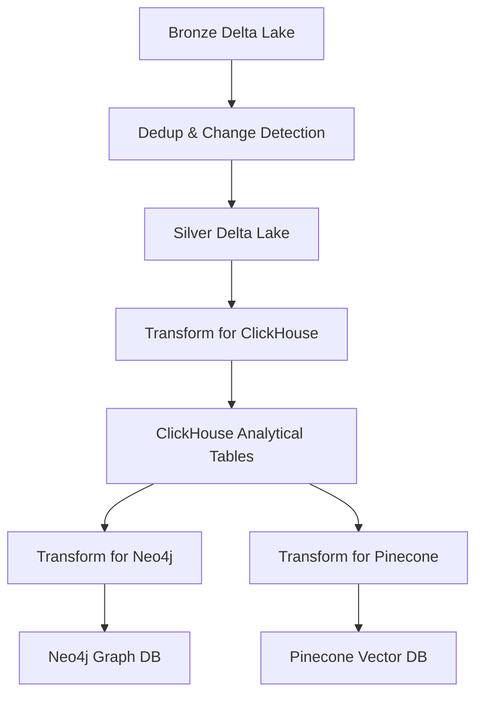

## Overview

The Batch Jobs module contains scheduled data pipelines orchestrated by Apache Airflow. It is responsible for transforming and moving data across storage layers and serving systems, implementing the **Bronze → Silver → Gold** data lakehouse architecture.

<Info>
This module ensures data consistency across analytical and serving layers while supporting both local and Kubernetes deployments.
</Info>

## Processing Overview

There are **4 main transformation tasks** executed in this module:

<CardGroup cols={2}>
  <Card title="Bronze → Silver" icon="filter">
    Parse full schema, detect changes, and deduplicate records using timestamp
  </Card>
  <Card title="Silver → ClickHouse" icon="database">
    Transform and load structured data into analytical tables
  </Card>
  <Card title="ClickHouse → Neo4j" icon="project-diagram">
    Build graph relationships for entity connections
  </Card>
  <Card title="ClickHouse → Pinecone" icon="brain">
    Generate and store embeddings for semantic retrieval
  </Card>
</CardGroup>

## Module Structure

```text
batch_jobs/
├── config/        # Pipeline & environment configuration
├── dags/          # Airflow DAG definitions
├── io/            # Database & storage readers/writers
│   ├── readers/   # Delta, ClickHouse readers
│   └── writers/   # Delta, ClickHouse, Neo4j, Pinecone writers
├── pipelines/     # Main pipeline entrypoints
│   ├── bronze_silver/    # Bronze to Silver transformations
│   ├── silver_silver/    # Silver to ClickHouse
│   └── silver_gold/      # ClickHouse to Neo4j/Pinecone
├── run_time/      # Runtime helpers & context
│   ├── spark/     # Spark session builders
│   ├── clickhouse/# ClickHouse utilities
│   └── redis/     # Redis version tracking
├── schema/        # Full bronze-layer schemas
├── script/        # Setup scripts (create tables)
└── transforms/    # Data transformation logic
    ├── delta_delta/       # Bronze to Silver transforms
    ├── delta_clickhouse/  # Silver to ClickHouse transforms
    ├── clickhouse_neo4j/  # ClickHouse to Neo4j transforms
    └── clickhouse_pinecone/ # ClickHouse to Pinecone transforms
```

## Architecture Flow



## Components

<Steps>

### IO Layer

Contains abstractions for interacting with external systems.

**Readers**:
- `DeltaMinioReader` - Read Delta tables from MinIO
- `ClickHouseReader` - Query ClickHouse tables

**Writers**:
- `DeltaMinioWriter` - Write Delta tables to MinIO
- `ClickHouseNativeWriter` - Write to ClickHouse using native protocol
- `ClickHouseJDBCWriter` - Write to ClickHouse using JDBC
- `Neo4jWriter` - Create nodes and relationships in Neo4j
- `PineconeWriter` - Upsert vectors to Pinecone

**Example - Delta Writer**:

```python
from pyspark.sql import SparkSession, DataFrame

class DeltaMinioWriter:
    def __init__(self, spark: SparkSession):
        self.spark = spark
    
    def overwrite(self, df: DataFrame, target_path: str):
        return df.write.format("delta").mode("overwrite").save(target_path)
    
    def append(self, df: DataFrame, target_path: str):
        return df.write.format("delta").mode("append").save(target_path)
    
    def write_first_with_cdf(self, df: DataFrame, target_path: str):
        return df.write.format("delta") \
            .mode("overwrite") \
            .option("delta.enableChangeDataFeed", "true") \
            .save(target_path)
```

### Schema

Defines the **full schema** of records stored in the Bronze layer.

<Note>
Unlike the stream processor (which only parses critical fields), batch jobs operate on complete records for correctness and consistency.
</Note>

Schemas are defined for:
- `MOVIE_FULL_SCHEMA` - Complete movie metadata structure
- `TV_SERIES_FULL_SCHEMA` - Complete TV series metadata structure
- `PERSON_FULL_SCHEMA` - Complete person metadata structure
- `DIFF_SCHEMA` - Change detection metadata
- `VECTOR_DF_SCHEMA` - Vector embedding structure

### Transforms

Responsible for transforming data between source and destination.

**Position in flow**: Reader → Transform → Writer

#### Bronze to Silver Transforms

**Key transformation: Upsert Latest**

```python
from delta.tables import DeltaTable
from pyspark.sql import SparkSession, DataFrame, Window
from pyspark.sql.functions import col, row_number

def upsert_latest(
    spark: SparkSession,
    from_df: DataFrame,
    data_type: str,
    raw_column: str,
    data_schema,
    to_folder: str,
    key_columns: list[str],
    ts_column: str
):
    """
    Upsert latest batch to Delta Lake, from Bronze to Silver Layer
    """
    # Deduplicate within batch
    clean_df = dedup_latest_batch(from_df, key_columns, ts_column)
    
    # Parse full schema
    parsed_df = parse_schema(df=clean_df, col=raw_column, schema=data_schema)
    
    # Hash columns for change detection
    hashed_df = full_hash_and_pre_diff_columns(parsed_df, HASH_CONFIGS[data_type])
    
    # Merge with existing table
    target_delta_table = DeltaTable.forPath(spark, to_folder)
    final_source_df = get_full_diff_by_hash(
        source_df=hashed_df,
        target_df=target_delta_table.toDF(),
        key_columns=key_columns
    )
    
    merge_condition = " AND ".join([f"t.{col} = s.{col}" for col in key_columns])
    update_condition = f"s.{ts_column} > t.{ts_column}"
    
    (
        target_delta_table.alias("t")
            .merge(source=final_source_df.alias("s"), condition=merge_condition)
            .whenMatchedUpdateAll(condition=update_condition)
            .whenNotMatchedInsertAll()
            .execute()
    )

def dedup_latest_batch(df: DataFrame, key_columns: list[str], ts_column: str):
    """
    Deduplicate DataFrame by latest timestamp
    """
    window = Window.partitionBy(*key_columns).orderBy(col(ts_column).desc())
    return df.withColumn("row_number", row_number().over(window)) \
        .filter(col("row_number") == 1) \
        .drop("row_number")
```

**Typical operations**:
- Change detection using hash comparison
- Deduplication by timestamp
- Field normalization
- Aggregation and joins

#### Silver to ClickHouse Transforms

Prepare normalized tables for analytical queries:
- `prepare_table_movie` - Main movie table
- `prepare_table_movie_cast` - Movie cast relationships
- `prepare_table_movie_crew` - Movie crew relationships
- Similar functions for TV series and person entities

### Script

Contains setup utilities required before running pipelines.

**Example**: Create ClickHouse tables before loading data.

```sql
CREATE TABLE IF NOT EXISTS movie (
    movie_id Int32,
    title String,
    overview String,
    release_date Date,
    vote_average Float32,
    batch_version Int64
) ENGINE = MergeTree()
ORDER BY (movie_id, batch_version);
```

### Pipelines

Contains the main functions invoked by Airflow.

#### Pipeline 1: Bronze → Silver

```python
from batch_jobs.io.readers.delta_minio_reader import DeltaMinioReader
from batch_jobs.tranforms.delta_delta.upsert_latest import upsert_latest

def run_dedup_timestamp():
    """
    Pipeline to dedup timestamp, from bronze to silver layer in Delta Lake Minio
    """
    settings = load_settings()
    redis_client = RedisClient()
    spark = create_spark_minio(app_name=settings.spark.app_name_1, settings=settings).getOrCreate()
    delta_minio_reader = DeltaMinioReader(spark)
    
    for data_type, target_folder in settings.storage.delta_lake.target_name_folder:
        # Get paths
        from_path, _ = get_valid_invalid_path(settings.storage.delta_lake.tables.bronze_layer, target_folder)
        to_path, _ = get_valid_invalid_path(settings.storage.delta_lake.tables.silver_layer, target_folder)
        
        # Get version from Redis
        version_key = f"{settings.storage.redis.keys.dedup_batch_version}_{data_type}"
        last_version = redis_client.get(version_key) or 0
        
        # Read change data feed
        delta_table = DeltaTable.forPath(spark, from_path)
        current_version = delta_table.history(1).select("version").collect()[0][0]
        from_df = delta_minio_reader.read_table_cdf(
            target_path=from_path,
            start_version=int(last_version),
            end_version=current_version
        )
        
        # Upsert to Silver
        upsert_latest(
            spark=spark,
            from_df=from_df,
            data_type=data_type,
            to_folder=to_path
        )
        redis_client.set(version_key, current_version)
```

<Note>
Version tracking using Redis ensures incremental processing - only new data since the last run is processed.
</Note>

#### Pipeline 2: Silver → ClickHouse

```python
def write_minio_to_clickhouse():
    """
    Pipeline to write to ClickHouse from Delta Lake Minio
    """
    settings = load_settings()
    init_clickhouse()  # Create tables if not exists
    
    redis_client = RedisClient()
    spark = create_spark_minio_clickhouse(settings=settings).getOrCreate()
    delta_minio_reader = DeltaMinioReader(spark)
    clickhouse_writer = ClickHouseNativeWriter(spark)
    
    for data_type, target_folder in settings.storage.delta_lake.target_name_folder:
        from_path, _ = get_valid_invalid_path(settings.storage.delta_lake.tables.silver_layer, target_folder)
        
        # Get batch version
        version_key = f"{settings.storage.redis.keys.dedup_batch_version}_{data_type}"
        last_version = redis_client.get(version_key)
        
        # Read only the latest batch
        from_df = delta_minio_reader.read_table_with_filters(
            target_path=from_path,
            filters={"batch_version": int(last_version)}
        )
        
        # Transform and write each table
        for table in TRANSFORM_MAP[data_type]:
            table_df = table["transform_func"](from_df)
            clickhouse_writer.write_table(df=table_df, table_name=table["table_name"])
```

### DAGs

Airflow orchestration layer. These DAGs must be mounted into the Airflow `dags_folder` to be detected and executed.

**Two types of DAGs**:

1. **Standard DAG** - For local or VM deployments
2. **KubernetesPodOperator DAG** - For running jobs on Kubernetes

```python
from airflow import DAG
from airflow.operators.python import PythonOperator
from datetime import datetime, timedelta

default_args = {
    'owner': 'data-platform',
    'depends_on_past': False,
    'start_date': datetime(2026, 1, 1),
    'retries': 1,
    'retry_delay': timedelta(minutes=5),
}

with DAG(
    'entertainment_data_pipeline',
    default_args=default_args,
    schedule_interval='@daily',
    catchup=False
) as dag:
    
    bronze_to_silver = PythonOperator(
        task_id='bronze_to_silver',
        python_callable=run_dedup_timestamp
    )
    
    silver_to_clickhouse = PythonOperator(
        task_id='silver_to_clickhouse',
        python_callable=write_minio_to_clickhouse
    )
    
    clickhouse_to_neo4j = PythonOperator(
        task_id='clickhouse_to_neo4j',
        python_callable=write_clickhouse_to_neo4j
    )
    
    clickhouse_to_pinecone = PythonOperator(
        task_id='clickhouse_to_pinecone',
        python_callable=write_clickhouse_to_pinecone
    )
    
    bronze_to_silver >> silver_to_clickhouse >> [clickhouse_to_neo4j, clickhouse_to_pinecone]
```

</Steps>

## Execution Flow

<Steps>

### Bronze → Silver

1. Read new records from Bronze Delta using Change Data Feed
2. Deduplicate by timestamp within batch
3. Parse full schema from raw JSON
4. Hash columns for change detection
5. Merge into Silver Delta with upsert logic
6. Update version in Redis

### Silver → ClickHouse

1. Read latest batch from Silver Delta (filter by version)
2. Transform into normalized tables (movie, cast, crew, etc.)
3. Write to ClickHouse using native protocol

### ClickHouse → Neo4j

1. Read entity relationships from ClickHouse
2. Transform into graph nodes and edges
3. Create/update nodes and relationships in Neo4j

### ClickHouse → Pinecone

1. Read entities with text fields from ClickHouse
2. Generate embeddings using ML model
3. Upsert vectors to Pinecone with metadata

</Steps>

## Quick Start

For quick testing without Airflow, you can run pipelines manually in order:

```bash
# 1. Bronze to Silver - Dedup & change detection
python -m batch_jobs.pipelines.bronze_silver.minio_to_minio

# 2. Silver to ClickHouse - Load analytical tables
python -m batch_jobs.pipelines.silver_silver.minio_to_clickhouse

# 3. ClickHouse to Neo4j - Build graph
python -m batch_jobs.pipelines.silver_gold.clickhouse_to_neo4j

# 4. ClickHouse to Pinecone - Generate embeddings
python -m batch_jobs.pipelines.silver_gold.clickhouse_to_pinecone
```

<Warning>
Ensure all dependencies (MinIO, ClickHouse, Redis, Neo4j, Pinecone) are running and accessible before executing pipelines.
</Warning>

## Key Features

- **Incremental Processing**: Uses Change Data Feed and version tracking
- **Change Detection**: Hash-based comparison to identify modified records
- **Deduplication**: Timestamp-based deduplication ensures latest data
- **Multi-Destination**: Writes to ClickHouse, Neo4j, and Pinecone
- **Orchestrated**: Airflow DAGs manage dependencies and scheduling
- **Kubernetes Ready**: Supports distributed execution on K8s
- **Version Tracking**: Redis tracks processed versions for idempotency

## Data Lakehouse Layers

<CardGroup cols={3}>
  <Card title="Bronze Layer" icon="database">
    Raw, immutable data from stream processor with full history
  </Card>
  <Card title="Silver Layer" icon="filter">
    Cleaned, deduplicated, and validated data with full schema
  </Card>
  <Card title="Gold Layer" icon="star">
    Aggregated, enriched data optimized for analytics and serving
  </Card>
</CardGroup>

## Configuration

Example configuration structure:

```yaml
spark:
  app_name_1: "BronzeToSilver"
  app_name_2: "SilverToClickHouse"

storage:
  delta_lake:
    tables:
      bronze_layer: "s3a://entertainment-data/bronze"
      silver_layer: "s3a://entertainment-data/silver"
    target_name_folder:
      - ["movie", "movie"]
      - ["tv_series", "tv_series"]
      - ["person", "person"]
  redis:
    keys:
      dedup_batch_version: "batch:version:dedup"

clickhouse:
  host: "localhost"
  port: 9000
  database: "entertainment"

neo4j:
  uri: "bolt://localhost:7687"
  username: "neo4j"
  password: "password"

pinecone:
  api_key: "your-api-key"
  environment: "us-west1-gcp"
  index_name: "entertainment-embeddings"
```

## Monitoring

### Check Processing Versions

```python
from batch_jobs.run_time.redis.redis_client import RedisClient

redis_client = RedisClient()
for data_type in ["movie", "tv_series", "person"]:
    version = redis_client.get(f"batch:version:dedup_{data_type}")
    print(f"{data_type}: version {version}")
```

### Query Delta History

```python
from delta import DeltaTable

delta_table = DeltaTable.forPath(spark, "s3a://entertainment-data/silver/movie")
history = delta_table.history()
history.select("version", "timestamp", "operation", "operationMetrics").show()
```

## Next Steps

After batch processing completes, data is ready for consumption:

<CardGroup cols={2}>
  <Card title="ClickHouse Analytics" icon="chart-line">
    Query analytical tables for insights and reporting
  </Card>
  <Card title="Neo4j Graph" icon="project-diagram">
    Explore entity relationships and connections
  </Card>
  <Card title="Pinecone Search" icon="magnifying-glass">
    Perform semantic search using vector embeddings
  </Card>
  <Card title="API Layer" icon="server">
    Build APIs on top of serving databases
  </Card>
</CardGroup>