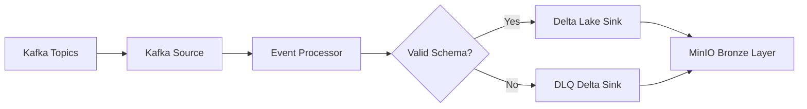

## Overview

The Stream Processor consumes streaming events from Kafka, processes them with PySpark Structured Streaming, and writes structured data into Delta tables stored on MinIO. A key design principle is **fault tolerance**: records that fail parsing will NOT stop the pipeline. Instead, they are redirected to a **Dead Letter Queue (DLQ)** stored in Delta on MinIO, ensuring no data loss.

<Info>
This module implements the **Bronze Layer** of the data lakehouse architecture, providing ACID transactions and schema evolution capabilities.
</Info>

## Architecture Flow



## Module Structure

```text
stream_processor/
├── config/        # Runtime & pipeline configuration
├── processor/     # Core transformation logic
├── runtime/       # Client wrappers (MinIO, configs, shared context)
├── schema/        # Lightweight schemas for parsing
├── sinks/         # Output writers (Delta on MinIO)
├── sources/       # Kafka ingestion logic
└── main.py        # Entry point
```

## Core Concepts

### Delta Lake on MinIO

Processed records are stored as Delta tables on MinIO, enabling:

<CardGroup cols={2}>
  <Card title="ACID Transactions" icon="shield-check">
    Atomicity, Consistency, Isolation, Durability for all writes
  </Card>
  <Card title="Schema Evolution" icon="code-branch">
    Safe schema changes without breaking existing queries
  </Card>
  <Card title="Time Travel" icon="clock-rotate-left">
    Query historical versions of data
  </Card>
  <Card title="Change Data Feed" icon="timeline">
    Track row-level changes over time
  </Card>
</CardGroup>

### Dead Letter Queue (DLQ)

Streaming systems must never stop because of bad records.

<Warning>
If an event fails schema parsing, has missing required fields, or contains corrupted JSON, it will be written to a **DLQ Delta table** on MinIO instead of breaking the pipeline.
</Warning>

This guarantees:
- **No data loss** - All events are captured
- **Easier debugging** - Bad records can be inspected and replayed
- **Stable operations** - Long-running streaming jobs remain resilient

## Components

<Steps>

### Sources

Handles Kafka consumption using PySpark Structured Streaming.

**Implementation**:

```python
from pyspark.sql import SparkSession, DataFrame

def read_kafka_stream(
    spark: SparkSession,
    settings: Settings,
    topic: str
) -> DataFrame:
    """
    Create Spark Kafka stream
    """
    return (spark.readStream
        .format("kafka")
        .option("kafka.bootstrap.servers", settings.sources.kafka.server.bootstrap_servers)
        .option("subscribe", topic)
        .option("startingOffsets", "latest")
        .option("kafka.isolation.level", "read_committed")
        .load()
    )
```

**Responsibilities**:
- Subscribe to configured topics
- Deserialize messages
- Convert Kafka records to DataFrame format

### Schema

Defines lightweight schemas used to parse incoming events.

**Design choice**: Only critical fields are parsed to improve performance and resilience. This is important because streaming payloads may evolve over time.

```python
from pyspark.sql.types import StructType, StructField, StringType, IntegerType

PARTIAL_EVENT_SCHEMA = StructType([
    StructField("data_type", StringType(), True),
    StructField("data_label", StringType(), True),
    StructField("timestamp", StringType(), True)
])

ID_SCHEMA = StructType([
    StructField("movie_id", IntegerType(), True),
    StructField("tv_series_id", IntegerType(), True),
    StructField("person_id", IntegerType(), True)
])
```

### Processor

Transforms events before writing to Delta Lake.

**Processing Pipeline**:

```python
from pyspark.sql import DataFrame
from pyspark.sql.functions import from_json, col, coalesce, current_timestamp

def process_event(df: DataFrame) -> DataFrame:
    """
    Full logic processing event
    """
    raw_df = cast_event(df)
    enriched_df = enrich_event(raw_df)
    validated_df = valid_full_schema(enriched_df)
    return validated_df

def cast_event(df: DataFrame) -> DataFrame:
    """
    Cast event to string and parse json.
    """
    raw_df = df.select(
        col("value").cast("string").alias("raw_df"),
        from_json(col("value").cast("string"), PARTIAL_EVENT_SCHEMA).alias("data")
    ).select("data.*", "raw_df")
    return raw_df

def enrich_event(df: DataFrame):
    """
    Enrich event with process timestamp
    """
    return df.withColumn("process_timestamp", current_timestamp())

def valid_full_schema(df: DataFrame):
    """
    Check valid schema by adding boolean value to 'valid_schema' column
    """
    id_info = from_json(col("raw_df"), ID_SCHEMA)
    return df.withColumn("id_info", id_info) \
        .withColumn(
            "id_of_data_type",
            coalesce(col("id_info.person_id"), col("id_info.movie_id"), col("id_info.tv_series_id"))
        ) \
        .withColumn(
            "valid_schema",
            col("data_type").isNotNull() &
            col("data_label").isNotNull() &
            col("timestamp").isNotNull() &
            col("process_timestamp").isNotNull() &
            col("id_of_data_type").isNotNull()
        ) \
        .drop("id_info")
```

**Typical tasks**:
- Apply schema parsing
- Normalize fields
- Add ingestion metadata
- Route invalid events to DLQ

### Runtime

Provides shared infrastructure clients.

**Examples**:
- MinIO client wrapper
- Config loader
- Shared Spark session context

This layer isolates external dependencies from business logic.

### Sinks

Responsible for writing output data to Delta Lake.

**Implementation**:

```python
from pyspark.sql import DataFrame
from pyspark.sql.functions import col

def split_valid_invalid_stream(df: DataFrame):
    """
    Split to 2 DataFrames by 'valid_schema' column.
    """
    valid_df = df.filter(col("valid_schema") == True).drop("valid_schema")
    invalid_df = df.filter(col("valid_schema") == False)
    return valid_df, invalid_df

def delta_lake_sink(df: DataFrame, table: str, checkpoint: str):
    """
    Create a single write stream to Delta Lake.
    """
    def log_batch(batch_df, batch_id):
        batch_df.write \
            .format("delta") \
            .mode("append") \
            .save(table)
    
    return (
        df.writeStream
            .format("delta")
            .outputMode("append")
            .option("checkpointLocation", checkpoint)
            .foreachBatch(log_batch)
            .start(table)
    )
```

**Outputs**:
- ✅ Valid records → Delta tables (MinIO)
- ⚠️ Invalid records → DLQ Delta table (MinIO)

**Handles**:
- Partitioning
- Table creation
- Upserts/append logic

</Steps>

## Processing Flow

<Steps>

### Consume Event

Read event from Kafka topic using PySpark Structured Streaming.

### Parse Schema

Parse using lightweight schema to extract critical fields.

### Validate

Check if all required fields are present and valid.

### Route & Write

- **Valid events** → Transform and write to Bronze Delta table
- **Invalid events** → Write to DLQ for later investigation

</Steps>

## Spark Configuration

The main application configures Spark with Delta Lake and MinIO support:

```python
builder = (
    SparkSession.builder
        .appName("KafkaStreamToDelta")
        .master("local[*]")
        .config("spark.sql.extensions", "io.delta.sql.DeltaSparkSessionExtension")
        .config("spark.sql.catalog.spark_catalog", "org.apache.spark.sql.delta.catalog.DeltaCatalog")
        .config("spark.jars.packages",
            "org.apache.spark:spark-sql-kafka-0-10_2.12:3.5.1,"
            "io.delta:delta-spark_2.12:3.2.0,"
            "org.apache.hadoop:hadoop-aws:3.3.4")
        .config("spark.databricks.delta.properties.defaults.enableChangeDataFeed", "true")
        .config("spark.hadoop.fs.s3a.impl", "org.apache.hadoop.fs.s3a.S3AFileSystem")
        .config("spark.hadoop.fs.s3a.endpoint", settings.sinks.delta_lake.minio_endpoint)
        .config("spark.hadoop.fs.s3a.access.key", settings.sinks.delta_lake.minio_access_key)
        .config("spark.hadoop.fs.s3a.secret.key", settings.sinks.delta_lake.minio_secret_key)
        .config("spark.hadoop.fs.s3a.path.style.access", "true")
)
spark = builder.getOrCreate()
```

<Note>
Change Data Feed is enabled by default to support downstream incremental processing in batch jobs.
</Note>

## Quick Start

<Steps>

### Configure Environment

Update configs in `config/settings.py`:

```yaml
sources:
  kafka:
    server:
      bootstrap_servers: "localhost:9092"
    topics:
      - ["movie", "movie-events"]
      - ["tv_series", "tv-series-events"]
      - ["person", "person-events"]

sinks:
  delta_lake:
    minio_endpoint: "http://localhost:9000"
    minio_access_key: "minioadmin"
    minio_secret_key: "minioadmin"
    core_bucket: "entertainment-data"
```

### Run Stream Job

```bash
export PYTHONPATH=$(pwd)/src
python -m stream_processor.main
```

The stream processor will:
1. Start Spark session with Delta Lake support
2. Create streaming queries for each Kafka topic
3. Process and validate incoming events
4. Write valid records to Bronze Delta tables
5. Write invalid records to DLQ tables

</Steps>

## Output Structure

The Stream Processor creates the following Delta tables on MinIO:

```text
s3a://entertainment-data/
├── bronze/
│   ├── movie/              # Valid movie records
│   ├── tv_series/          # Valid TV series records
│   ├── person/             # Valid person records
│   ├── movie_dlq/          # Invalid movie records
│   ├── tv_series_dlq/      # Invalid TV series records
│   └── person_dlq/         # Invalid person records
└── checkpoints/
    ├── movie/
    ├── tv_series/
    └── person/
```

## Key Features

- **Fault Tolerant**: DLQ pattern ensures no data loss
- **ACID Guarantees**: Delta Lake provides transactional consistency
- **Schema Evolution**: Supports safe schema changes over time
- **Change Data Feed**: Tracks all row-level changes for incremental processing
- **Lightweight Parsing**: Only validates critical fields for performance
- **MinIO Storage**: S3-compatible object storage for cost-effective data lake

<Warning>
Ensure MinIO and Kafka are running before starting the stream processor. Check connectivity to both services.
</Warning>

## Monitoring & Debugging

To inspect the DLQ for invalid records:

```python
from pyspark.sql import SparkSession

# Read DLQ table
dlq_df = spark.read.format("delta").load("s3a://entertainment-data/bronze/movie_dlq")
dlq_df.show(truncate=False)

# Analyze common failure patterns
dlq_df.groupBy("data_type").count().show()
```

## Next Steps

After the Stream Processor writes to the Bronze layer, Batch Jobs process the data further:

<Card title="Batch Jobs" icon="right" href="/components/batch-jobs">
  Learn how Batch Jobs transform Bronze data into Silver and Gold layers
</Card>