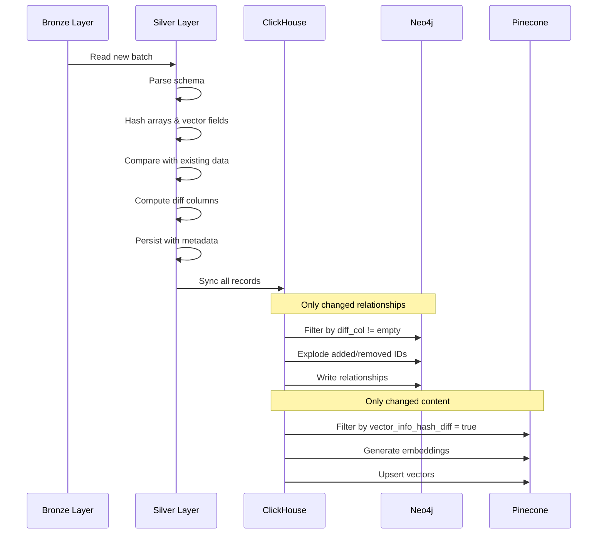

The Entertainment Data Platform implements a **sophisticated change-tracking mechanism** during the Silver layer refinement. This system detects changes in relationship and embedding fields, ensuring that expensive downstream updates to Neo4j and Pinecone only occur when data has actually changed.

<Note>
**Performance Impact**: Change tracking reduces Neo4j API calls and Pinecone vector upserts by up to 80% by synchronizing only modified records.
</Note>

---

## Why Change Tracking?

Without change tracking, every batch would blindly update all records in downstream databases, even if nothing changed. This creates several problems:

<CardGroup cols={2}>
  <Card title="High API Costs" icon="dollar-sign">
    Vector databases charge per operation. Unnecessary updates waste money.
  </Card>
  <Card title="Write Latency" icon="clock">
    Graph and vector databases have slower write performance than analytical DBs.
  </Card>
  <Card title="Resource Waste" icon="circle-exclamation">
    CPU cycles spent re-encoding unchanged text into identical vectors.
  </Card>
  <Card title="Network Overhead" icon="network-wired">
    Transferring large embedding arrays when nothing changed.
  </Card>
</CardGroup>

**The Solution**: Track exactly what changed and only update affected records.

---

## Change Detection Strategy

The platform tracks two categories of changes:

1. **Array Changes**: Modifications to cast/crew relationships
2. **Vector Info Changes**: Modifications to content used for embeddings

### Hash-Based Comparison

Implemented in `src/batch_jobs/tranforms/delta_delta/hash_column.py`:

```python
# Hash configuration by entity type
HASH_CONFIGS = {
    "movie": {
        "array": [
            {"array_col": "parsed_raw_df.casts_info", 
             "prefix_target_column_name": "casts", 
             "id_element_field": "cast_id"},
            {"array_col": "parsed_raw_df.crews_info", 
             "prefix_target_column_name": "crews", 
             "id_element_field": "person_id"},
        ],
        "vector_info_cols": ["parsed_raw_df.movie_detail.overview"],
        "array_prefix": ["casts", "crews"]
    },
    "tv_series": {
        "array": [
            {"array_col": "parsed_raw_df.casts_info", 
             "prefix_target_column_name": "casts", 
             "id_element_field": "cast_id"},
            {"array_col": "parsed_raw_df.crews_info", 
             "prefix_target_column_name": "crews", 
             "id_element_field": "person_id"},
        ],
        "vector_info_cols": ["parsed_raw_df.tv_series_detail.overview"],
        "array_prefix": ["casts", "crews"]
    },
    "person": {
        "array": [],
        "vector_info_cols": [],
        "array_prefix": []
    }
}
```

<Info>
**Person entities** do not require change tracking because they have no relationships or embedding fields.
</Info>

---

## Array Change Tracking

Array change tracking identifies added and removed elements in cast and crew arrays.

### Step 1: Element Hashing

Each array element is hashed individually:

```python
df = df.withColumn(
    "casts_elements_hash",
    transform(
        col="casts_info",
        f=lambda x: struct(
            x["cast_id"].alias("id"),
            xxhash64(x).alias("hash")
        )
    )
)
```

**Result**: Array of `{id, hash}` pairs

**Example:**
```json
[
  {"id": 123, "hash": -8234567890123456},
  {"id": 456, "hash": 1234567890123456},
  {"id": 789, "hash": 9876543210987654}
]
```

### Step 2: Total Array Hashing

The entire array is hashed to detect any changes:

```python
df = df.withColumn(
    "casts_total_hash",
    xxhash64(array_sort(transform(
        col="casts_elements_hash", 
        f=lambda x: x["hash"]
    )))
)
```

<Warning>
Array is **sorted before hashing** to ensure consistent hash values regardless of element order.
</Warning>

### Step 3: Compare with Existing Data

Join source DataFrame with target Delta table to compare hashes:

```python
join_df = source_df.alias("s").join(
    other=target_df.select(*required_cols).alias("t"),
    on=key_columns,  # ["data_type", "id_of_data_type"]
    how="left"
)
```

### Step 4: Compute Differences

When hashes differ, compute exactly which elements were added/removed:

```python
# Get added elements
elements_add = array_except(s_elements_hash, t_elements_hash)

# Get removed elements
elements_remove = array_except(t_elements_hash, s_elements_hash)

# Extract only IDs
ids_add = transform(elements_add, lambda x: x["id"])
ids_remove = transform(elements_remove, lambda x: x["id"])

# Create diff structure
diff_col = when(
    (col(s_total_hash) != col(t_total_hash)) | col(t_total_hash).isNull(),
    struct(
        ids_add.alias("added"),
        ids_remove.alias("removed")
    )
).otherwise(get_empty_ids_array_struct())
```

**Result**: A `diff` column containing:
```json
{
  "added": [789, 101],
  "removed": [456]
}
```

<Tip>
If no changes detected, the diff structure contains empty arrays: `{"added": [], "removed": []}`
</Tip>

### Diff Schema

Defined in `src/batch_jobs/schema/diff_schema.py`:

```python
DIFF_SCHEMA = StructType([
    StructField("added", ArrayType(LongType()), True),
    StructField("removed", ArrayType(LongType()), True)
])
```

---

## Vector Info Change Tracking

Vector info tracking identifies when embedding-relevant content changes.

### Tracked Fields

- **Movies**: `overview` field
- **TV Series**: `overview` field

<Info>
Only `overview` is tracked (not `tagline`) because overview changes are more significant for content similarity.
</Info>

### Implementation

```python
# Hash the overview field
df = df.withColumn(
    "vector_info_hash", 
    xxhash64(col("parsed_raw_df.movie_detail.overview"))
)

# Compare with existing hash
vector_diff_col = when(
    col("t.vector_info_hash").isNull() |
    (col("s.vector_info_hash") != col("t.vector_info_hash")),
    lit(True)
).otherwise(lit(False))

df = df.withColumn("vector_info_hash_diff", vector_diff_col)
```

**Result**: Boolean flag indicating whether re-embedding is needed

---

## Storage in Silver Layer

Change tracking metadata is persisted in the Silver layer Delta tables:

### Hash Columns

| Column | Purpose |
|--------|--------|
| `vector_info_hash` | Hash of embedding-relevant content |
| `casts_elements_hash` | Array of per-element cast hashes |
| `casts_total_hash` | Hash of entire cast array |
| `crews_elements_hash` | Array of per-element crew hashes |
| `crews_total_hash` | Hash of entire crew array |

### Diff Columns

| Column | Purpose |
|--------|--------|
| `vector_info_hash_diff` | Boolean: Does embedding need update? |
| `casts_diff` | JSON: `{"added": [ids...], "removed": [ids...]}` |
| `crews_diff` | JSON: `{"added": [ids...], "removed": [ids...]}` |

<Warning>
Diff columns are stored as **JSON strings** in Silver layer to maintain compatibility with Delta Lake. They're parsed back to structs during Gold layer processing.
</Warning>

---

## Using Change Tracking in Gold Layer

Downstream pipelines consume change tracking metadata to optimize synchronization.

### Neo4j Relationship Sync

Implemented in `src/batch_jobs/tranforms/clickhouse_neo4j/join_relationship.py`:

```python
def join_to_get_relationship(
    left_df: DataFrame,
    right_df: DataFrame,
    key_cols: list[str],
    diff_col: str,
    action_col: str,  # "added" or "removed"
    id_col_in_diff: str,
    relationship_properties: list[str]
):
    # Parse diff column
    parse_diff_df = left_df.select(*key_cols, diff_col) \
        .withColumn("parsed_diff", from_json(diff_col, DIFF_SCHEMA)) \
        .withColumn(id_col_in_diff, explode_outer(f"parsed_diff.{action_col}")) \
        .filter(col(id_col_in_diff).isNotNull()) \
        .select(*key_cols, col(id_col_in_diff))
    
    # Join to get full relationship data
    join_df = parse_diff_df.join(
        right_df,
        on=[*key_cols, id_col_in_diff],
        how="inner"
    ).select(*key_cols, id_col_in_diff, *relationship_properties)
    
    return join_df
```

**Process:**
1. Parse `casts_diff` JSON string
2. Explode `added` array to get individual cast IDs
3. Join with `movie_cast` table to get full cast details
4. Write only these relationships to Neo4j

**Repeat for:**
- `added` cast members
- `removed` cast members
- `added` crew members
- `removed` crew members

<Info>
**Deletion Handling**: Neo4j relationships with `removed` IDs are deleted via `DETACH DELETE` queries.
</Info>

### Pinecone Vector Sync

Implemented in `src/batch_jobs/pipelines/silver_gold/clickhouse_to_pinecone.py`:

```python
# Filter only records with vector changes
filters = [
    {"batch_version": int(last_version)},
    {"vector_info_hash_diff": True}
]

table_reader = clickhouse_reader.read_table_with_filters(
    table_name=table_name, 
    filters=filters
)

# Generate embeddings only for filtered records
vector_df = prepare_vector_schema(
    df=table_reader,
    id_col="movie_id",
    namespace="movie_namespace",
    model_name="intfloat/e5-large-v2",
    vector_prepare_cols=["overview", "tagline"],
    vector_col_name="document"
)

# Upsert to Pinecone
pinecone_writer.write_index(vector_df)
```

<Tip>
**Efficiency Gain**: If a batch processes 10,000 movie records but only 200 have content changes, only 200 embeddings are generated and upserted to Pinecone.
</Tip>

---

## Change Tracking Flow



---

## Configuration

Change tracking is automatically applied during the Bronze-to-Silver pipeline:

```python
# From src/batch_jobs/pipelines/bronze_silver/minio_to_minio.py

parsed_df = parse_schema(df=clean_df, col="raw_df", schema=data_schema)

# Apply hashing and diff computation
hashed_df = full_hash_and_pre_diff_columns(
    parsed_df, 
    HASH_CONFIGS[data_type]
)

# Compare with existing data and compute diffs
final_source_df = get_full_diff_by_hash(
    source_df=hashed_df,
    target_df=target_delta_table.toDF(),
    key_columns=key_columns,
    prefixes=HASH_CONFIGS[data_type]["array_prefix"]
)
```

<Note>
Change tracking is **always enabled** for Movie and TV Series entities. There's no configuration to disable it.
</Note>

---

## Performance Characteristics

### Computational Cost

- **Hash computation**: O(n) where n = array length
- **Array comparison**: O(n) using PySpark's `array_except`
- **Storage overhead**: ~100 bytes per record for metadata

### Benefits

<CardGroup cols={2}>
  <Card title="Neo4j Write Reduction" icon="chart-line-down">
    **70-85%** fewer relationship writes
  </Card>
  <Card title="Pinecone Cost Savings" icon="piggy-bank">
    **90%+** reduction in embedding API calls
  </Card>
  <Card title="Processing Time" icon="stopwatch">
    **60%** faster Gold layer pipelines
  </Card>
  <Card title="Network Bandwidth" icon="download">
    **80%** less data transferred to external DBs
  </Card>
</CardGroup>

<Warning>
**Trade-off**: Change tracking adds 10-15% overhead to Silver layer processing, but this is vastly outweighed by downstream savings.
</Warning>

---

## Debugging Change Tracking

Inspect change tracking metadata in Silver layer:

```python
from pyspark.sql import SparkSession
from delta import DeltaTable

spark = SparkSession.builder.getOrCreate()

# Read Silver layer table
df = spark.read.format("delta").load("s3://bucket/silver/movie")

# Check hash columns
df.select("movie_id", "casts_total_hash", "crews_total_hash", "vector_info_hash").show()

# Check diff columns
df.select("movie_id", "casts_diff", "crews_diff", "vector_info_hash_diff").show(truncate=False)

# Filter only changed records
changed_df = df.filter(
    (df.casts_diff != '{"added": [], "removed": []}') |
    (df.crews_diff != '{"added": [], "removed": []}') |
    (df.vector_info_hash_diff == True)
)
print(f"Changed records: {changed_df.count()}")
```

---

## Future Enhancements

Potential improvements to the change-tracking mechanism:

1. **Configurable hash algorithms**: Support SHA256 or MurmurHash3
2. **Partial array updates**: Track property changes within existing elements
3. **Temporal change analysis**: Analyze change patterns over time
4. **Change audit log**: Dedicated table for change history
5. **Smart re-embedding**: Only re-embed if semantic similarity drops below threshold

<Tip>
The current implementation using xxHash64 provides an excellent balance between speed and collision resistance for this use case.
</Tip>