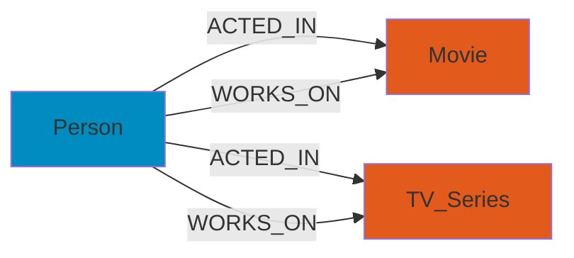

The Entertainment Data Platform processes three core entity types: **Movies**, **TV Series**, and **People**. Each entity follows a strongly-typed schema defined using PySpark StructType.

<Note>
All schemas are located in `src/batch_jobs/schema/` and are used throughout the pipeline for validation, parsing, and transformation.
</Note>

---

## Movie Schema

Movies are the primary entertainment entity, containing metadata, cast, crew, and classification information.

### Schema Definition

Defined in `src/batch_jobs/schema/movie_schema.py`:

```python
MOVIE_FULL_SCHEMA = StructType([
    StructField("movie_id", LongType(), True),
    StructField("casts_info", ArrayType(
        StructType([
            StructField("cast_id", LongType(), True),
            StructField("character", StringType(), True),
            StructField("credit_id", StringType(), True),
            StructField("known_for_department", StringType(), True),
            StructField("person_id", LongType(), True)
        ])
    )),
    StructField("crews_info", ArrayType(
        StructType([
            StructField("department", StringType(), True),
            StructField("job", StringType(), True),
            StructField("known_for_department", StringType(), True),
            StructField("person_id", LongType(), True)
        ])
    )),
    StructField("movie_detail", StructType([
        StructField("id", LongType(), True),
        StructField("original_title", StringType(), True),
        StructField("overview", StringType(), True),
        StructField("popularity", DoubleType(), True),
        StructField("release_date", StringType(), True),
        StructField("tagline", StringType(), True),
        StructField("vote_average", DoubleType(), True),
        StructField("vote_count", LongType(), True),
        StructField("genres", ArrayType(
            StructType([
                StructField("id", LongType(), True),
                StructField("name", StringType(), True)
            ])
        ), True),
        StructField("belongs_to_collection", ArrayType(
            StructType([
                StructField("id", LongType(), True),
                StructField("name", StringType(), True),
            ])
        ), True),
        StructField("production_countries", ArrayType(
            StructType([
                StructField("iso_3166_1", StringType(), True),
                StructField("name", StringType(), True)
            ])
        ), True),
    ]))
])
```

### Field Descriptions

<AccordionGroup>
  <Accordion title="movie_id" icon="key">
    **Type**: `LongType`
    
    Unique identifier for the movie. Primary key used across all layers and downstream databases.
  </Accordion>
  
  <Accordion title="casts_info" icon="users">
    **Type**: `ArrayType[Struct]`
    
    Array of cast members who acted in the movie. Each element contains:
    - `cast_id`: Unique identifier for this cast role
    - `character`: Character name portrayed
    - `credit_id`: TMDB credit identifier
    - `known_for_department`: Actor's primary department
    - `person_id`: Foreign key to Person entity
    
    <Info>This array is used to build `Person -[ACTED_IN]-> Movie` relationships in Neo4j.</Info>
  </Accordion>
  
  <Accordion title="crews_info" icon="user-group">
    **Type**: `ArrayType[Struct]`
    
    Array of crew members who worked on the movie. Each element contains:
    - `department`: Work department (e.g., "Directing", "Writing")
    - `job`: Specific job title (e.g., "Director", "Screenplay")
    - `known_for_department`: Person's primary department
    - `person_id`: Foreign key to Person entity
    
    <Info>This array is used to build `Person -[WORKS_ON]-> Movie` relationships in Neo4j.</Info>
  </Accordion>
  
  <Accordion title="movie_detail" icon="film">
    **Type**: `Struct`
    
    Core movie metadata containing:
    - `id`: Duplicate of movie_id for validation
    - `original_title`: Official movie title
    - `overview`: Plot synopsis (used for vector embeddings)
    - `popularity`: TMDB popularity score
    - `release_date`: Release date string (format: YYYY-MM-DD)
    - `tagline`: Marketing tagline (used for vector embeddings)
    - `vote_average`: Average user rating
    - `vote_count`: Total number of ratings
    - `genres`: Array of genre classifications
    - `belongs_to_collection`: Movie franchise/collection information
    - `production_countries`: Array of production country codes
  </Accordion>
</AccordionGroup>

### ClickHouse Representation

Movies are stored across three normalized tables in ClickHouse:

#### movie table
```sql
CREATE TABLE silver_layer.movie (
    movie_id UInt64,
    original_title String,
    overview String,
    popularity Float64,
    release_date Date,
    tagline String,
    vote_average Float64,
    vote_count UInt64,
    genres Array(Tuple(id UInt64, name String)),
    belongs_to_collection Array(Tuple(id UInt64, name String)),
    production_countries Array(Tuple(iso_3166_1 String, name String)),
    -- Change tracking fields
    vector_info_hash Int64,
    casts_total_hash Int64,
    crews_total_hash Int64,
    vector_info_hash_diff Bool,
    casts_diff String,
    crews_diff String,
    batch_version UInt64
)
ENGINE = ReplacingMergeTree(batch_version)
ORDER BY movie_id;
```

#### movie_cast table
```sql
CREATE TABLE silver_layer.movie_cast (
    movie_id UInt64,
    cast_id UInt64,
    person_id UInt64,
    character String,
    credit_id String,
    known_for_department String,
    batch_version UInt64
)
ENGINE = ReplacingMergeTree(batch_version)
ORDER BY (movie_id, cast_id);
```

#### movie_crew table
```sql
CREATE TABLE silver_layer.movie_crew (
    movie_id UInt64,
    person_id UInt64,
    department String,
    job String,
    known_for_department String,
    batch_version UInt64
)
ENGINE = ReplacingMergeTree(batch_version)
ORDER BY (movie_id, person_id);
```

---

## TV Series Schema

TV Series entities follow a similar structure to Movies but include series-specific fields.

### Schema Definition

Defined in `src/batch_jobs/schema/tv_series_schema.py`:

```python
TV_SERIES_FULL_SCHEMA = StructType([
    StructField("tv_series_id", LongType(), True),
    StructField("casts_info", ArrayType(
        StructType([
            StructField("cast_id", LongType(), True),
            StructField("character", StringType(), True),
            StructField("credit_id", StringType(), True),
            StructField("known_for_department", StringType(), True),
            StructField("person_id", LongType(), True)
        ])
    )),
    StructField("crews_info", ArrayType(
        StructType([
            StructField("department", StringType(), True),
            StructField("job", StringType(), True),
            StructField("known_for_department", StringType(), True),
            StructField("person_id", LongType(), True)
        ])
    )),
    StructField("tv_series_detail", StructType([
        StructField("id", LongType(), True),
        StructField("overview", StringType(), True),
        StructField("popularity", DoubleType(), True),
        StructField("first_air_date", StringType(), True),
        StructField("tagline", StringType(), True),
        StructField("vote_average", DoubleType(), True),
        StructField("vote_count", LongType(), True),
        StructField("status", StringType(), True),
        StructField("genres", ArrayType(
            StructType([
                StructField("id", LongType(), True),
                StructField("name", StringType(), True)
            ])
        ), True),
        StructField("production_countries", ArrayType(
            StructType([
                StructField("iso_3166_1", StringType(), True),
                StructField("name", StringType(), True)
            ])
        ), True),
        StructField("number_of_seasons", IntegerType(), True),
    ]), True)
])
```

### Key Differences from Movies

<CardGroup cols={2}>
  <Card title="first_air_date" icon="calendar">
    TV series use `first_air_date` instead of `release_date`
  </Card>
  <Card title="status" icon="circle-check">
    Series status: "Returning Series", "Ended", "Canceled", etc.
  </Card>
  <Card title="number_of_seasons" icon="layer-group">
    Total number of seasons produced
  </Card>
  <Card title="No Collection" icon="xmark">
    TV Series don't have `belongs_to_collection` field
  </Card>
</CardGroup>

### ClickHouse Representation

TV Series are stored in three tables mirroring the movie structure:
- `silver_layer.tv_series`
- `silver_layer.tv_series_cast`
- `silver_layer.tv_series_crew`

---

## Person Schema

People represent actors, directors, crew members, and other entertainment industry professionals.

### Schema Definition

Defined in `src/batch_jobs/schema/person_schema.py`:

```python
PERSON_FULL_SCHEMA = StructType([
    StructField("person_id", LongType(), True),
    StructField("person_detail", StructType([
        StructField("id", LongType(), True),
        StructField("name", StringType(), True),
        StructField("gender", IntegerType(), True),
        StructField("also_known_as", ArrayType(StringType()), True),
        StructField("biography", StringType(), True),
        StructField("birthday", StringType(), True),
        StructField("deathday", StringType(), True),
        StructField("place_of_birth", StringType(), True),
        StructField("known_for_department", StringType(), True),
        StructField("popularity", DoubleType(), True),
    ]), True)
])
```

### Field Descriptions

| Field | Type | Description |
|-------|------|-------------|
| `person_id` | `LongType` | Unique identifier for the person |
| `name` | `StringType` | Full name |
| `gender` | `IntegerType` | Gender code (0=Not specified, 1=Female, 2=Male) |
| `also_known_as` | `Array[String]` | Alternative names and aliases |
| `biography` | `StringType` | Professional biography |
| `birthday` | `StringType` | Birth date (YYYY-MM-DD) |
| `deathday` | `StringType` | Death date if applicable |
| `place_of_birth` | `StringType` | Birthplace location |
| `known_for_department` | `StringType` | Primary profession (e.g., "Acting", "Directing") |
| `popularity` | `DoubleType` | TMDB popularity score |

<Note>
People do NOT have `casts_info` or `crews_info` arrays. These relationships are defined on Movie and TV Series entities.
</Note>

### ClickHouse Representation

```sql
CREATE TABLE silver_layer.person (
    person_id UInt64,
    name String,
    gender UInt8,
    also_known_as Array(String),
    biography String,
    birthday Date,
    deathday Nullable(Date),
    place_of_birth String,
    known_for_department String,
    popularity Float64,
    batch_version UInt64
)
ENGINE = ReplacingMergeTree(batch_version)
ORDER BY person_id;
```

---

## Relationship Model

The platform implements a rich relationship model in Neo4j, derived from the array fields in Movie and TV Series entities.

### Graph Schema



### ACTED_IN Relationship

Created from `casts_info` arrays:

**Properties:**
- `cast_id`: Unique casting identifier
- `character`: Character name portrayed
- `credit_id`: TMDB credit ID
- `known_for_department`: Actor's department
- `batch_version`: Processing batch version

**Example Cypher:**
```cypher
MATCH (p:Person {person_id: 123})-[r:ACTED_IN]->(m:Movie {movie_id: 456})
RETURN p.name, r.character, m.original_title
```

### WORKS_ON Relationship

Created from `crews_info` arrays:

**Properties:**
- `department`: Work department
- `job`: Specific job title
- `known_for_department`: Person's primary department
- `batch_version`: Processing batch version

**Example Cypher:**
```cypher
MATCH (p:Person {person_id: 789})-[r:WORKS_ON]->(m:Movie {movie_id: 456})
WHERE r.job = 'Director'
RETURN p.name, m.original_title
```

<Tip>
Relationships are created incrementally using the change-tracking mechanism. Only added or removed cast/crew members trigger Neo4j writes. See [Change Tracking](/concepts/change-tracking) for details.
</Tip>

---

## Vector Embeddings

Movies and TV Series are encoded as vector embeddings for semantic search in Pinecone.

### Embedding Configuration

Defined in `src/batch_jobs/pipelines/silver_gold/clickhouse_to_pinecone.py`:

```python
TRANSFORM_MAP = {
    "movie": {
        "id_col": "movie_id",
        "vector_prepare_cols": ["overview", "tagline"],
        "vector_col_name": "document",
        "metadata": "{}"
    },
    "tv_series": {
        "id_col": "tv_series_id",
        "vector_prepare_cols": ["overview", "tagline"],
        "vector_col_name": "document",
        "metadata": "{}"
    },
}
```

**Embedding model**: `intfloat/e5-large-v2`

<Info>
Only the `overview` and `tagline` fields are used for embedding generation. Changes to these fields trigger re-embedding via the `vector_info_hash_diff` flag.
</Info>

---

## Data Source

All data originates from **TMDB (The Movie Database) API**:

- **Collector**: `src/collector/`
- **Datasets**: Available on [Kaggle](https://www.kaggle.com/datasets/khoatm2k4/tmdb-craw-dataset) and [HuggingFace](https://huggingface.co/datasets/tmkhoa/tmdb-craw-dataset)

<Warning>
The schemas are tightly coupled to TMDB's API response format. Schema evolution requires updates to parsing logic in `src/batch_jobs/tranforms/delta_delta/parse_schema.py`.
</Warning>