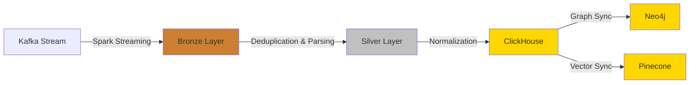

The Entertainment Data Platform implements a **Medallion Architecture** - a multi-layered data processing pattern that progressively refines raw data into analytics-ready assets. This architecture ensures data reliability through ACID transactions while optimizing performance with Delta Lake.

## Architecture Overview

The platform organizes data transformation through three distinct layers:

<Steps>
  <Step title="Bronze Layer: Raw Data Storage">
    Immutable storage of raw events for auditing and reprocessing
  </Step>
  <Step title="Silver Layer: Cleaned & Deduplicated">
    Single source of truth with schema validation and change tracking
  </Step>
  <Step title="Gold Layer: Analytics-Ready">
    Business-optimized tables for specific query patterns
  </Step>
</Steps>

<Note>
Each layer is stored as Delta Lake tables on MinIO object storage, providing ACID guarantees, time travel capabilities, and efficient upsert operations.
</Note>

---

## Bronze Layer

The Bronze layer serves as the **landing zone** for all incoming data, capturing raw events exactly as they arrive from Kafka streams.

### Key Characteristics

<CardGroup cols={2}>
  <Card title="Immutable Storage" icon="lock">
    Raw events are never modified, preserving complete audit trails
  </Card>
  <Card title="Schema-on-Read" icon="file-code">
    Minimal validation - only critical fields are checked
  </Card>
  <Card title="High Throughput" icon="gauge-high">
    Optimized for fast ingestion with Spark Structured Streaming
  </Card>
  <Card title="Dead Letter Queue" icon="triangle-exclamation">
    Invalid records are routed to separate storage without halting the pipeline
  </Card>
</CardGroup>

### Data Ingestion Process

The Bronze layer ingestion is handled by the stream processor located in `src/stream_processor/`:

```python
# Lightweight validation - only check critical fields
df = df.withColumn(
    "valid_schema",
    col("data_type").isNotNull() &
    col("data_label").isNotNull() &
    col("timestamp").isNotNull() &
    col("process_timestamp").isNotNull() &
    col("id_of_data_type").isNotNull()
)
```

<Info>
**Performance Optimization**: By validating only essential fields (`data_type`, `id_of_data_type`, `timestamp`), the system maintains high throughput even when upstream schemas are unstable.
</Info>

### Storage Structure

Bronze layer data is organized by entity type:

```
bronze_layer/
├── movie/
│   ├── _delta_log/
│   └── data files
├── tv_series/
│   ├── _delta_log/
│   └── data files
└── person/
    ├── _delta_log/
    └── data files
```

Each record in the Bronze layer contains:
- **raw_df**: Complete JSON payload from Kafka
- **data_type**: Entity type (movie, tv_series, person)
- **data_label**: Record status (old, new, change)
- **timestamp**: Event timestamp
- **process_timestamp**: Ingestion timestamp
- **id_of_data_type**: Entity identifier
- **valid_schema**: Boolean validation flag

---

## Silver Layer

The Silver layer transforms chaotic Bronze data into a **clean, deduplicated, single source of truth**. This is where the platform implements sophisticated deduplication, schema parsing, and change tracking.

### Deduplication Strategy

The platform uses **timestamp-based deduplication** to handle late-arriving and duplicate events:

```python
# Keep only the latest record for each entity
window = Window.partitionBy(*key_columns).orderBy(col(ts_column).desc())
target_df = df.withColumn("row_number", row_number().over(window)) \
                .filter(col("row_number") == 1) \
                .drop("row_number")
```

**Key columns**: `["data_type", "id_of_data_type"]`  
**Timestamp column**: `"timestamp"`

### Delta Lake Upsert Operations

The Bronze-to-Silver pipeline in `src/batch_jobs/pipelines/bronze_silver/minio_to_minio.py` uses Delta Lake's MERGE operation:

```python
# Upsert logic: Update if newer timestamp, otherwise insert
target_delta_table.alias("t") \
    .merge(
        source=final_source_df.alias("s"),
        condition="t.data_type = s.data_type AND t.id_of_data_type = s.id_of_data_type"
    ) \
    .whenMatchedUpdateAll(condition="s.timestamp > t.timestamp") \
    .whenNotMatchedInsertAll() \
    .execute()
```

<Warning>
The upsert operation only updates records when the source timestamp is **newer** than the target timestamp. This prevents older records from overwriting fresher data.
</Warning>

### Schema Validation & Parsing

After deduplication, the raw JSON is parsed into strongly-typed structures:

```python
# Parse raw_df column using predefined schemas
parsed_df = parse_schema(df=clean_df, col="raw_df", schema=data_schema)
```

See the [Data Model](/concepts/data-model) documentation for complete schema definitions.

### Change Tracking

The Silver layer implements an **intelligent change-tracking mechanism** to optimize downstream synchronization. See [Change Tracking](/concepts/change-tracking) for detailed implementation.

### Incremental Processing

The platform uses **Change Data Feed (CDF)** to process only new or changed records:

```python
# Read only data between last processed version and current version
from_df = delta_minio_reader.read_table_cdf(
    target_path=from_path,
    start_version=int(last_version),
    end_version=current_version
)
```

Version tracking is managed via Redis:
- **Key pattern**: `dedup_batch_version_{data_type}`
- **Value**: Last processed Delta Lake version number

---

## Gold Layer

The Gold layer represents **analytics-ready data** optimized for specific consumption patterns. Data is transformed from Silver and loaded into specialized databases.

### Multi-Database Strategy

<CardGroup cols={3}>
  <Card title="ClickHouse" icon="chart-column">
    **OLAP Analytics**
    
    Fast aggregations and statistical reporting with normalized tables
  </Card>
  <Card title="Neo4j" icon="diagram-project">
    **Knowledge Graph**
    
    Relationship exploration between Movies, TV Series, and People
  </Card>
  <Card title="Pinecone" icon="vector-square">
    **Vector Search**
    
    Semantic search and RAG applications with embedded content
  </Card>
</CardGroup>

### ClickHouse Transformation

The Silver-to-ClickHouse pipeline (`src/batch_jobs/pipelines/silver_silver/minio_to_clickhouse.py`) denormalizes nested structures:

**Single movie record transforms into:**
- 1 row in `movie` table
- N rows in `movie_cast` table (one per cast member)
- M rows in `movie_crew` table (one per crew member)

```sql
CREATE TABLE silver_layer.movie
(
    movie_id UInt64,
    original_title String,
    overview String,
    popularity Float64,
    release_date Date,
    tagline String,
    vote_average Float64,
    vote_count UInt64,
    genres Array(Tuple(id UInt64, name String)),
    -- Change tracking metadata
    vector_info_hash Int64,
    casts_total_hash Int64,
    crews_total_hash Int64,
    casts_diff String,
    crews_diff String,
    batch_version UInt64
)
ENGINE = ReplacingMergeTree(batch_version)
ORDER BY movie_id;
```

<Info>
The `ReplacingMergeTree` engine automatically deduplicates rows with the same `movie_id`, keeping the row with the highest `batch_version`.
</Info>

### Neo4j Synchronization

The ClickHouse-to-Neo4j pipeline (`src/batch_jobs/pipelines/silver_gold/clickhouse_to_neo4j.py`) creates:

**Nodes:**
- Movie nodes
- TV_Series nodes
- Person nodes

**Relationships:**
- `Person -[ACTED_IN]-> Movie/TV_Series`
- `Person -[WORKS_ON]-> Movie/TV_Series`

### Pinecone Synchronization

The ClickHouse-to-Pinecone pipeline (`src/batch_jobs/pipelines/silver_gold/clickhouse_to_pinecone.py`) generates vector embeddings:

```python
# Combine overview and tagline for embedding
vector_df = prepare_vector_schema(
    df=table_reader,
    id_col="movie_id",
    namespace="movie_namespace",
    model_name="intfloat/e5-large-v2",
    vector_prepare_cols=["overview", "tagline"],
    vector_col_name="document"
)
```

---

## Data Flow Summary



<Tip>
**Why Medallion Architecture?**

- **Flexibility**: Reprocess data from any layer without impacting downstream consumers
- **Performance**: Each layer optimized for its specific purpose
- **Reliability**: ACID guarantees at every stage via Delta Lake
- **Cost-Efficiency**: Change tracking minimizes expensive downstream writes
</Tip>

## Pipeline Execution

Run the complete pipeline step-by-step:

```bash
# Bronze → Silver: Deduplication and change tracking
python -m batch_jobs.pipelines.bronze_silver.minio_to_minio

# Silver → ClickHouse: Analytical layer
python -m batch_jobs.pipelines.silver_silver.minio_to_clickhouse

# Gold: Knowledge graph synchronization
python -m batch_jobs.pipelines.silver_gold.clickhouse_to_neo4j

# Gold: Vector database synchronization
python -m batch_jobs.pipelines.silver_gold.clickhouse_to_pinecone
```

<Note>
All pipelines are orchestrated by Apache Airflow in production. See the DAG definitions in `src/batch_jobs/dags/`.
</Note>