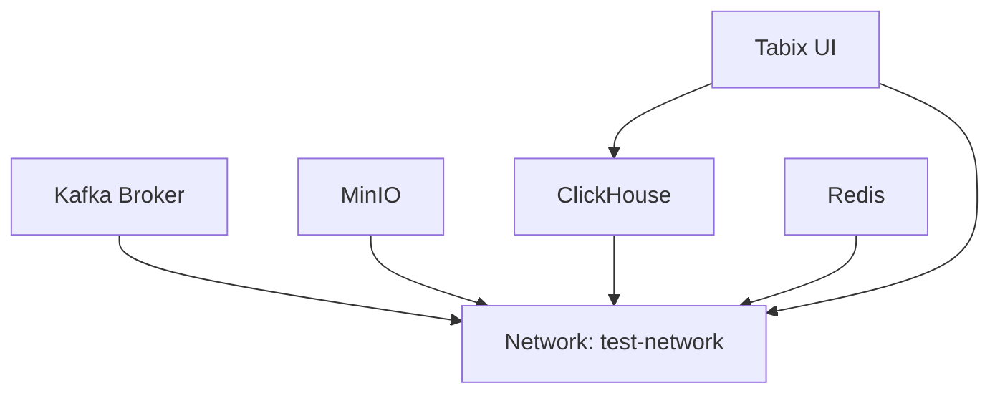

This guide covers deploying the complete Entertainment Data Platform infrastructure using Docker Compose for rapid prototyping and integrated testing.

## Overview

The Docker Compose setup provides a fully containerized environment that includes all infrastructure components needed to run the platform. This deployment strategy is ideal for:

- Local development and testing
- CI/CD pipeline integration
- Demonstration and proof-of-concept deployments
- Learning and experimentation

<Warning>
  Docker Compose is designed for single-host deployments and is not recommended for production use at scale. For production deployments, see the [Kubernetes Deployment](/deployment/kubernetes) guide.
</Warning>

## Architecture

The Docker Compose configuration deploys the following services:



All services are connected via a custom bridge network named `test-network`, enabling service-to-service communication using container names.

## Prerequisites

<CardGroup cols={2}>
  <Card title="Docker Engine" icon="docker">
    Version 20.10 or later
  </Card>
  <Card title="Docker Compose" icon="layer-group">
    Version 2.0 or later
  </Card>
  <Card title="Available Memory" icon="memory">
    At least 8GB RAM recommended
  </Card>
  <Card title="Available Disk" icon="hard-drive">
    At least 10GB free space
  </Card>
</CardGroup>

## Configuration File

The Docker Compose configuration is located at `deployment/docker/docker_compose.yml`. Here's the complete configuration:

<Accordion title="View Full docker_compose.yml">
```yaml
services:
  broker1:
    image: apache/kafka:latest
    hostname: broker1
    container_name: broker1
    restart: unless-stopped
    ports:
      - 9092:9092
    environment:
      KAFKA_BROKER_ID: 1
      KAFKA_LISTENER_SECURITY_PROTOCOL_MAP: PLAINTEXT:PLAINTEXT,PLAINTEXT_HOST:PLAINTEXT,CONTROLLER:PLAINTEXT
      KAFKA_ADVERTISED_LISTENERS: PLAINTEXT://broker1:29092,PLAINTEXT_HOST://localhost:9092
      KAFKA_OFFSETS_TOPIC_REPLICATION_FACTOR: 1
      KAFKA_GROUP_INITIAL_REBALANCE_DELAY_MS: 0
      KAFKA_LOG_RETENTION_MS: "9000000"
      KAFKA_LOG_RETENTION_BYTES: "2147483648"
      KAFKA_AUTO_CREATE_TOPICS_ENABLE: "true"
      KAFKA_TRANSACTION_STATE_LOG_MIN_ISR: 1
      KAFKA_TRANSACTION_STATE_LOG_REPLICATION_FACTOR: 1
      KAFKA_PROCESS_ROLES: broker,controller
      KAFKA_NUM_PARTITIONS: 3
      KAFKA_NODE_ID: 1
      KAFKA_CONTROLLER_QUORUM_VOTERS: 1@broker1:29093
      KAFKA_LISTENERS: PLAINTEXT://broker1:29092,CONTROLLER://broker1:29093,PLAINTEXT_HOST://0.0.0.0:9092
      KAFKA_INTER_BROKER_LISTENER_NAME: PLAINTEXT
      KAFKA_CONTROLLER_LISTENER_NAMES: CONTROLLER
      KAFKA_LOG_DIRS: /tmp/kraft-combined-logs-1
      CLUSTER_ID: MkU3OEVBNTcwNTJENDM2Qk
    healthcheck:
      test: [ "CMD", "sh", "-c", "nc -z broker1 29092 || exit 1" ]
      interval: 5s
      timeout: 3s
      retries: 10
    networks:
      - test-network

  minio:
    container_name: minio
    image: minio/minio
    restart: unless-stopped
    ports:
      - 9000:9000
      - 9001:9001
    environment:
      MINIO_ROOT_USER: minio
      MINIO_ROOT_PASSWORD: minio123
    networks:
      - test-network
    command: server --console-address ":9001" /data

  clickhouse:
    image: clickhouse/clickhouse-server
    container_name: clickhouse
    restart: unless-stopped
    ports:
      - 8123:8123
      - 9002:9000
    environment:
      - CLICKHOUSE_DEFAULT_ACCESS_MANAGEMENT=1
    networks:
      - test-network

  tabix:
    image: spoonest/clickhouse-tabix-web-client
    container_name: tabix
    restart: unless-stopped
    ports:
      - 8081:80
    depends_on:
      - clickhouse
    networks:
      - test-network

  redis:
    image: redis:8.2.1-alpine
    ports:
      - "6379:6379"
    networks:
      test-network:

networks:
  test-network:
    driver: bridge
```
</Accordion>

## Service Details

### Apache Kafka (broker1)

Kafka runs in KRaft mode (without ZooKeeper) for simplified deployment.

<Tabs>
  <Tab title="Configuration">
    **Key Settings:**
    - **Broker ID**: 1
    - **Partitions**: 3 (default for new topics)
    - **Replication Factor**: 1 (single broker)
    - **Retention Time**: 9,000,000 ms (2.5 hours)
    - **Retention Size**: 2GB per partition
    - **Auto Create Topics**: Enabled

    **Ports:**
    - `9092`: External client connections (PLAINTEXT_HOST)
    - `29092`: Inter-broker communication (PLAINTEXT)
    - `29093`: Controller communication
  </Tab>
  <Tab title="Access">
    Connect to Kafka from your application:

    ```python
    from confluent_kafka import Producer

    conf = {
        'bootstrap.servers': 'localhost:9092',
        'client.id': 'my-producer'
    }
    producer = Producer(conf)
    ```

    Or from the command line:

    ```bash
    # List topics
    docker exec broker1 kafka-topics --bootstrap-server localhost:9092 --list

    # Create a topic
    docker exec broker1 kafka-topics --bootstrap-server localhost:9092 \
      --create --topic test-topic --partitions 3

    # Describe a topic
    docker exec broker1 kafka-topics --bootstrap-server localhost:9092 \
      --describe --topic test-topic
    ```
  </Tab>
  <Tab title="Health Check">
    The Kafka service includes a health check that verifies the broker is accepting connections:

    - **Test**: `nc -z broker1 29092`
    - **Interval**: 5 seconds
    - **Timeout**: 3 seconds
    - **Retries**: 10

    Check health status:
    ```bash
    docker compose ps broker1
    ```
  </Tab>
</Tabs>

### MinIO Object Storage

MinIO provides S3-compatible object storage for Delta Lake tables.

<Tabs>
  <Tab title="Configuration">
    **Key Settings:**
    - **Root User**: `minio`
    - **Root Password**: `minio123`
    - **Storage Path**: `/data` (inside container)
    - **Console Address**: Port 9001

    **Ports:**
    - `9000`: S3 API endpoint
    - `9001`: Web console UI
  </Tab>
  <Tab title="Access">
    **Web Console:**
    - URL: http://localhost:9001
    - Username: `minio`
    - Password: `minio123`

    **Python Client:**
    ```python
    from minio import Minio

    client = Minio(
        "localhost:9000",
        access_key="minio",
        secret_key="minio123",
        secure=False
    )

    # List buckets
    buckets = client.list_buckets()
    for bucket in buckets:
        print(bucket.name)
    ```

    **S3 CLI:**
    ```bash
    export AWS_ACCESS_KEY_ID=minio
    export AWS_SECRET_ACCESS_KEY=minio123
    export AWS_ENDPOINT_URL=http://localhost:9000

    aws s3 ls --endpoint-url $AWS_ENDPOINT_URL
    ```
  </Tab>
</Tabs>

### ClickHouse Database

ClickHouse provides OLAP analytics capabilities for the Gold layer.

<Tabs>
  <Tab title="Configuration">
    **Key Settings:**
    - **HTTP Port**: 8123
    - **Native Port**: 9002 (mapped from 9000)
    - **Access Management**: Enabled

    **Default Credentials:**
    - Username: `default`
    - Password: (empty by default)
  </Tab>
  <Tab title="Access">
    **Python Client:**
    ```python
    import clickhouse_connect

    client = clickhouse_connect.get_client(
        host='localhost',
        port=8123
    )

    # Execute query
    result = client.query('SHOW DATABASES')
    print(result.result_rows)
    ```

    **CLI:**
    ```bash
    # Connect to ClickHouse client
    docker exec -it clickhouse clickhouse-client

    # Execute query directly
    docker exec clickhouse clickhouse-client --query "SHOW TABLES"
    ```

    **HTTP Interface:**
    ```bash
    curl 'http://localhost:8123/?query=SELECT+version()'
    ```
  </Tab>
</Tabs>

### Redis Cache

Redis provides in-memory caching and state management.

<Tabs>
  <Tab title="Configuration">
    **Key Settings:**
    - **Image**: `redis:8.2.1-alpine`
    - **Port**: 6379
    - **Persistence**: Disabled (ephemeral)
  </Tab>
  <Tab title="Access">
    **Python Client:**
    ```python
    import redis

    r = redis.Redis(
        host='localhost',
        port=6379,
        decode_responses=True
    )

    # Set and get a value
    r.set('key', 'value')
    value = r.get('key')
    ```

    **CLI:**
    ```bash
    # Connect to Redis CLI
    docker exec -it redis redis-cli

    # Execute commands
    docker exec redis redis-cli PING
    docker exec redis redis-cli INFO
    ```
  </Tab>
</Tabs>

### Tabix Web Client

Tabix provides a web-based UI for querying ClickHouse.

- **URL**: http://localhost:8081
- **ClickHouse Host**: Use `http://clickhouse:8123` or `http://localhost:8123`
- **Features**: Query editor, table browser, result visualization

## Deployment Steps

<Steps>
  <Step title="Navigate to Docker Directory">
    ```bash
    cd deployment/docker
    ```
  </Step>

  <Step title="Start All Services">
    ```bash
    docker compose -f docker_compose.yml up -d
    ```

    The `-d` flag runs containers in detached mode (background).
  </Step>

  <Step title="Verify Services are Running">
    ```bash
    docker compose ps
    ```

    All services should show status "Up" or "Up (healthy)".
  </Step>

  <Step title="View Logs (Optional)">
    ```bash
    # All services
    docker compose logs -f

    # Specific service
    docker compose logs -f broker1
    ```
  </Step>
</Steps>

## Management Commands

### Start Services

```bash
# Start all services
docker compose up -d

# Start specific service
docker compose up -d minio
```

### Stop Services

```bash
# Stop all services
docker compose stop

# Stop specific service
docker compose stop broker1
```

### Restart Services

```bash
# Restart all services
docker compose restart

# Restart specific service
docker compose restart clickhouse
```

### Remove Services

```bash
# Stop and remove containers
docker compose down

# Remove containers and volumes (deletes all data)
docker compose down -v

# Remove containers, volumes, and images
docker compose down -v --rmi all
```

### View Logs

```bash
# Follow logs for all services
docker compose logs -f

# View last 100 lines
docker compose logs --tail=100

# Logs for specific service
docker compose logs -f minio
```

### Execute Commands in Containers

```bash
# Open bash shell in container
docker compose exec broker1 bash

# Execute specific command
docker compose exec clickhouse clickhouse-client --query "SHOW DATABASES"
```

## Networking

All services are connected to a custom bridge network named `test-network`. This allows services to communicate using container names:

```python
# From within the Docker network, services can access each other by name:
kafka_host = "broker1:29092"
minio_host = "minio:9000"
clickhouse_host = "clickhouse:8123"
redis_host = "redis:6379"
```

<Note>
  From your host machine, use `localhost` with the mapped ports. From other containers in the `test-network`, use the service names with internal ports.
</Note>

## Persistent Data

<Warning>
  By default, this Docker Compose setup does not use volumes for data persistence. All data is stored inside containers and will be lost when containers are removed.
</Warning>

To add persistence, modify `docker_compose.yml` to include volumes:

```yaml
services:
  minio:
    volumes:
      - minio-data:/data

  clickhouse:
    volumes:
      - clickhouse-data:/var/lib/clickhouse

volumes:
  minio-data:
  clickhouse-data:
```

## Resource Limits

For production-like testing, you can add resource limits to prevent containers from consuming all system resources:

```yaml
services:
  broker1:
    deploy:
      resources:
        limits:
          cpus: '2'
          memory: 2G
        reservations:
          cpus: '1'
          memory: 1G
```

## Troubleshooting

<AccordionGroup>
  <Accordion title="Port Already Allocated">
    If you see "port is already allocated" errors:

    1. Check which process is using the port:
       ```bash
       sudo lsof -i :9092
       ```

    2. Modify the port mapping in `docker_compose.yml`:
       ```yaml
       ports:
         - "19092:9092"  # Use different host port
       ```

    3. Restart the services:
       ```bash
       docker compose down
       docker compose up -d
       ```
  </Accordion>

  <Accordion title="Services Not Communicating">
    If services cannot reach each other:

    1. Verify all services are on the same network:
       ```bash
       docker network inspect docker_test-network
       ```

    2. Check DNS resolution inside a container:
       ```bash
       docker compose exec broker1 ping minio
       ```

    3. Use container names, not `localhost`, for inter-service communication
  </Accordion>

  <Accordion title="Kafka Not Ready">
    Kafka can take 30-60 seconds to fully start:

    1. Check health status:
       ```bash
       docker compose ps broker1
       ```

    2. Watch logs for "started" message:
       ```bash
       docker compose logs -f broker1 | grep -i started
       ```

    3. Test connectivity:
       ```bash
       docker exec broker1 kafka-broker-api-versions --bootstrap-server localhost:9092
       ```
  </Accordion>

  <Accordion title="Out of Memory">
    If containers crash due to memory issues:

    1. Check Docker daemon memory limits:
       ```bash
       docker info | grep Memory
       ```

    2. Increase Docker memory in Docker Desktop settings (if applicable)

    3. Add resource limits to prevent any single service from consuming too much:
       ```yaml
       deploy:
         resources:
           limits:
             memory: 2G
       ```
  </Accordion>
</AccordionGroup>

## Next Steps

<CardGroup cols={2}>
  <Card title="Local Setup Guide" icon="laptop" href="/deployment/local-setup">
    Learn how to run application services
  </Card>
  <Card title="Kubernetes Deployment" icon="dharmachakra" href="/deployment/kubernetes">
    Scale to production with Kubernetes
  </Card>
</CardGroup>
