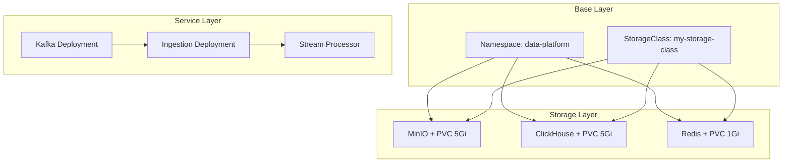

This guide covers deploying the Entertainment Data Platform to a Kubernetes cluster for production-grade, scalable deployments.

## Overview

The Kubernetes deployment provides a cloud-native, orchestrated environment with:

- **Scalability**: Horizontal scaling for processing workloads
- **High Availability**: Replicated services with health checks
- **Resource Management**: CPU and memory limits/requests
- **Persistent Storage**: StatefulSets for databases
- **Service Discovery**: Internal DNS for service communication
- **External Access**: NodePort services for external connectivity

<Info>
  The Kubernetes manifests are organized into three logical layers that must be applied in a specific order to ensure proper dependencies.
</Info>

## Prerequisites

<CardGroup cols={2}>
  <Card title="Kubernetes Cluster" icon="dharmachakra">
    Running cluster (v1.24+)
    - Minikube, kind, or cloud provider
    - At least 3 nodes recommended
  </Card>
  <Card title="kubectl" icon="terminal">
    Kubernetes CLI tool
    - Version matching cluster
    - Configured with cluster access
  </Card>
  <Card title="Storage Provisioner" icon="hard-drive">
    Dynamic volume provisioner
    - Default StorageClass or custom
    - At least 20GB available
  </Card>
  <Card title="Container Registry" icon="docker">
    Access to images
    - Docker Hub or private registry
    - Pull credentials if needed
  </Card>
</CardGroup>

## Architecture

The Kubernetes deployment is organized into three layers:



## Directory Structure

The Kubernetes manifests are organized as follows:

```bash
deployment/k8s/
├── base/
│   ├── 01-namespace.yaml           # Namespace definition
│   └── 02-storageclass.yaml        # Storage provisioning
├── storage/
│   ├── 01-minio.yaml               # Object storage
│   ├── 02-clickhouse.yaml          # OLAP database
│   └── 03-redis.yaml               # Cache layer
└── services/
    ├── 01-kafka.yaml               # Message broker
    ├── 02-ingestion.yaml           # Data producers
    └── 03-stream-processor.yaml    # Spark streaming
```

## Deployment Steps

<Warning>
  Apply manifests **file by file** in the exact order listed below. This ensures dependencies are met and services start correctly.
</Warning>

### Step 1: Foundational Infrastructure

<Steps>
  <Step title="Create Namespace">
    Apply the namespace manifest to isolate platform resources:

    ```bash
    kubectl apply -f k8s/base/01-namespace.yaml
    ```

    This creates the `data-platform` namespace:

    ```yaml
    apiVersion: v1
    kind: Namespace
    metadata:
      name: data-platform
      labels:
        name: data-platform
    ```

    Verify:
    ```bash
    kubectl get namespace data-platform
    ```
  </Step>

  <Step title="Configure Storage Class">
    Apply the StorageClass for persistent volume provisioning:

    ```bash
    kubectl apply -f k8s/base/02-storageclass.yaml
    ```

    This creates a StorageClass named `my-storage-class`:

    ```yaml
    apiVersion: storage.k8s.io/v1
    kind: StorageClass
    metadata:
      name: my-storage-class
    provisioner: k8s.io/minikube-hostpath
    reclaimPolicy: Delete
    ```

    <Note>
      The provisioner `k8s.io/minikube-hostpath` is for Minikube. For cloud providers, use:
      - AWS: `kubernetes.io/aws-ebs`
      - GCP: `kubernetes.io/gce-pd`
      - Azure: `kubernetes.io/azure-disk`
    </Note>

    Verify:
    ```bash
    kubectl get storageclass my-storage-class
    ```
  </Step>
</Steps>

### Step 2: Persistent Storage Layer

Deploy databases and object storage with persistent volumes.

<Steps>
  <Step title="Deploy MinIO Object Storage">
    ```bash
    kubectl apply -f k8s/storage/01-minio.yaml
    ```

    This creates:
    - **PersistentVolumeClaim**: 5Gi for Delta Lake storage
    - **Service (Internal)**: ClusterIP for pod-to-pod communication
    - **Service (External)**: NodePort for external access
    - **Deployment**: MinIO server with credentials

    <Accordion title="MinIO Configuration Details">
      **Environment Variables:**
      - `MINIO_ROOT_USER`: `minio`
      - `MINIO_ROOT_PASSWORD`: `minio123`

      **Ports:**
      - `9000`: S3 API (NodePort: 30081)
      - `9001`: Web Console (NodePort: 30082)

      **Volume Mount:**
      - `/data` → PVC `minio-pvc`

      **Command:**
      ```bash
      server --console-address ":9001" /data
      ```
    </Accordion>

    Verify:
    ```bash
    kubectl get pods -n data-platform -l app=minio
    kubectl get pvc -n data-platform minio-pvc
    kubectl get svc -n data-platform minio-external
    ```
  </Step>

  <Step title="Deploy ClickHouse Database">
    ```bash
    kubectl apply -f k8s/storage/02-clickhouse.yaml
    ```

    This creates:
    - **PersistentVolumeClaim**: 5Gi for database storage
    - **Service (Internal)**: ClusterIP for internal queries
    - **Service (External)**: NodePort for Tabix UI
    - **Deployment**: ClickHouse server
    - **Deployment**: Tabix web client

    <Accordion title="ClickHouse Configuration Details">
      **Ports:**
      - `8123`: HTTP interface
      - `9000`: Native protocol

      **Volume Mount:**
      - `/var/lib/clickhouse` → PVC `clickhouse-pvc`

      **Tabix Access:**
      - Port: 80 (NodePort: 30080)
      - ClickHouse Host: `clickhouse-internal:8123`
    </Accordion>

    Verify:
    ```bash
    kubectl get pods -n data-platform -l app=clickhouse
    kubectl get pods -n data-platform -l app=tabix
    kubectl get pvc -n data-platform clickhouse-pvc
    ```
  </Step>

  <Step title="Deploy Redis Cache">
    ```bash
    kubectl apply -f k8s/storage/03-redis.yaml
    ```

    This creates:
    - **PersistentVolumeClaim**: 1Gi for Redis data
    - **Service**: ClusterIP on port 6379
    - **Deployment**: Redis with AOF persistence

    <Accordion title="Redis Configuration Details">
      **Image**: `redis:8.2.1-alpine`

      **Args:**
      ```bash
      --appendonly yes
      ```

      **Volume Mount:**
      - `/data` → PVC `redis-pvc`

      **Port**: 6379
    </Accordion>

    Verify:
    ```bash
    kubectl get pods -n data-platform -l app=redis
    kubectl get pvc -n data-platform redis-pvc
    ```
  </Step>
</Steps>

### Step 3: Application Services

Deploy core processing services in order.

<Steps>
  <Step title="Deploy Kafka Message Broker">
    ```bash
    kubectl apply -f k8s/services/01-kafka.yaml
    ```

    This creates:
    - **Service**: ClusterIP for internal Kafka access
    - **Deployment**: Kafka in KRaft mode

    <Accordion title="Kafka Configuration Details">
      **Environment Variables:**
      - `KAFKA_BROKER_ID`: 1
      - `KAFKA_PROCESS_ROLES`: broker,controller
      - `KAFKA_NUM_PARTITIONS`: 3
      - `KAFKA_OFFSETS_TOPIC_REPLICATION_FACTOR`: 1
      - `KAFKA_LOG_RETENTION_MS`: 9000000 (2.5 hours)
      - `KAFKA_LOG_RETENTION_BYTES`: 2147483648 (2GB)
      - `KAFKA_AUTO_CREATE_TOPICS_ENABLE`: true

      **Listeners:**
      - `PLAINTEXT`: Internal communication (port 29092)
      - `PLAINTEXT_HOST`: Client connections (port 9092)
      - `CONTROLLER`: Controller communication (port 29093)

      **Advertised Listeners:**
      ```
      PLAINTEXT://kafka-internal:29092,PLAINTEXT_HOST://kafka-internal:9092
      ```

      **Controller Quorum:**
      ```
      1@kafka-internal.data-platform.svc.cluster.local:29093
      ```
    </Accordion>

    Verify:
    ```bash
    kubectl get pods -n data-platform -l app=kafka
    kubectl logs -n data-platform -l app=kafka --tail=50
    ```

    Wait for Kafka to be ready before proceeding (30-60 seconds).
  </Step>

  <Step title="Deploy Ingestion Service">
    ```bash
    kubectl apply -f k8s/services/02-ingestion.yaml
    ```

    This creates:
    - **Deployment**: Ingestion producers

    <Accordion title="Ingestion Configuration Details">
      **Image**: `khoa2k4/entertainment_data_platform:ingestion_v1`

      **Environment:**
      - `APP_ENV`: prod

      **Resources:**
      - **Requests**: 1 CPU, 2Gi memory
      - **Limits**: 2 CPU, 3Gi memory

      **Image Pull Policy**: Always
    </Accordion>

    Verify:
    ```bash
    kubectl get pods -n data-platform -l app=ingestion
    kubectl logs -n data-platform -l app=ingestion --tail=50
    ```
  </Step>

  <Step title="Deploy Stream Processor">
    ```bash
    kubectl apply -f k8s/services/03-stream-processor.yaml
    ```

    This creates:
    - **Deployment**: Spark streaming application

    <Accordion title="Stream Processor Configuration Details">
      **Image**: `khoa2k4/entertainment_data_platform:stream_processor_v1`

      **Environment:**
      - `APP_ENV`: prod

      **Resources:**
      - **Requests**: 1 CPU, 2Gi memory
      - **Limits**: 2 CPU, 3Gi memory

      **Image Pull Policy**: Always
    </Accordion>

    Verify:
    ```bash
    kubectl get pods -n data-platform -l app=stream-processor
    kubectl logs -n data-platform -l app=stream-processor --tail=50
    ```
  </Step>
</Steps>

## Verification

After deployment, verify all components are running:

### Check All Pods

```bash
kubectl get pods -n data-platform
```

Expected output:
```
NAME                                  READY   STATUS    RESTARTS   AGE
clickhouse-deployment-xxx             1/1     Running   0          5m
ingestion-xxx                         1/1     Running   0          2m
kafka-deployment-xxx                  1/1     Running   0          3m
minio-deployment-xxx                  1/1     Running   0          6m
redis-deployment-xxx                  1/1     Running   0          5m
stream-processor-xxx                  1/1     Running   0          1m
tabix-deployment-xxx                  1/1     Running   0          5m
```

### Check Services

```bash
kubectl get svc -n data-platform
```

### Check Persistent Volumes

```bash
kubectl get pvc -n data-platform
```

All PVCs should show status "Bound".

## Access Services

### Internal Access (from within cluster)

Services can access each other using internal DNS names:

```python
# From application code running in the cluster
kafka_host = "kafka-internal.data-platform.svc.cluster.local:9092"
minio_host = "minio-internal.data-platform.svc.cluster.local:9000"
clickhouse_host = "clickhouse-internal.data-platform.svc.cluster.local:8123"
redis_host = "redis-internal.data-platform.svc.cluster.local:6379"
```

### External Access (from outside cluster)

<Tabs>
  <Tab title="Minikube">
    For Minikube, use the node IP with NodePort:

    ```bash
    # Get Minikube IP
    minikube ip

    # Access services
    # MinIO API: http://<minikube-ip>:30081
    # MinIO Console: http://<minikube-ip>:30082
    # Tabix UI: http://<minikube-ip>:30080
    ```

    Or use Minikube service command:
    ```bash
    minikube service minio-external -n data-platform
    minikube service tabix-external -n data-platform
    ```
  </Tab>
  <Tab title="Cloud Provider">
    For cloud Kubernetes clusters, use LoadBalancer services or Ingress:

    1. Change service type to LoadBalancer:
       ```yaml
       type: LoadBalancer
       ```

    2. Or create an Ingress:
       ```yaml
       apiVersion: networking.k8s.io/v1
       kind: Ingress
       metadata:
         name: platform-ingress
         namespace: data-platform
       spec:
         rules:
         - host: minio.example.com
           http:
             paths:
             - path: /
               pathType: Prefix
               backend:
                 service:
                   name: minio-internal
                   port:
                     number: 9001
       ```
  </Tab>
  <Tab title="Port Forwarding">
    For development, use kubectl port-forward:

    ```bash
    # MinIO Console
    kubectl port-forward -n data-platform svc/minio-internal 9001:9001

    # MinIO API
    kubectl port-forward -n data-platform svc/minio-internal 9000:9000

    # ClickHouse HTTP
    kubectl port-forward -n data-platform svc/clickhouse-internal 8123:8123

    # Tabix UI
    kubectl port-forward -n data-platform svc/tabix-external 8081:80

    # Redis
    kubectl port-forward -n data-platform svc/redis-internal 6379:6379
    ```

    Then access at `http://localhost:<port>`
  </Tab>
</Tabs>

## Monitoring

### View Pod Logs

```bash
# Follow logs for a specific pod
kubectl logs -f <pod-name> -n data-platform

# Follow logs for all pods with label
kubectl logs -f -l app=kafka -n data-platform

# View last 100 lines
kubectl logs --tail=100 <pod-name> -n data-platform

# View logs from previous container (if crashed)
kubectl logs --previous <pod-name> -n data-platform
```

### Describe Resources

```bash
# Describe a pod (shows events and status)
kubectl describe pod <pod-name> -n data-platform

# Describe a service
kubectl describe svc kafka-internal -n data-platform

# Describe a PVC
kubectl describe pvc minio-pvc -n data-platform
```

### Execute Commands in Pods

```bash
# Open shell in pod
kubectl exec -it <pod-name> -n data-platform -- bash

# Execute specific command
kubectl exec <pod-name> -n data-platform -- <command>

# Example: Check Kafka topics
KAFKA_POD=$(kubectl get pod -n data-platform -l app=kafka -o jsonpath='{.items[0].metadata.name}')
kubectl exec $KAFKA_POD -n data-platform -- kafka-topics --bootstrap-server localhost:9092 --list
```

### Resource Usage

```bash
# Pod resource usage
kubectl top pods -n data-platform

# Node resource usage
kubectl top nodes
```

## Scaling

### Scale Deployments

```bash
# Scale ingestion service to 3 replicas
kubectl scale deployment ingestion -n data-platform --replicas=3

# Scale stream processor
kubectl scale deployment stream-processor -n data-platform --replicas=2

# Check replica status
kubectl get deployment -n data-platform
```

### Horizontal Pod Autoscaler

Create an HPA for automatic scaling:

```yaml
apiVersion: autoscaling/v2
kind: HorizontalPodAutoscaler
metadata:
  name: stream-processor-hpa
  namespace: data-platform
spec:
  scaleTargetRef:
    apiVersion: apps/v1
    kind: Deployment
    name: stream-processor
  minReplicas: 1
  maxReplicas: 5
  metrics:
  - type: Resource
    resource:
      name: cpu
      target:
        type: Utilization
        averageUtilization: 70
```

Apply:
```bash
kubectl apply -f hpa.yaml
```

## Updates and Rollbacks

### Update Deployment Image

```bash
# Update image version
kubectl set image deployment/ingestion \
  ingestion=khoa2k4/entertainment_data_platform:ingestion_v2 \
  -n data-platform

# Check rollout status
kubectl rollout status deployment/ingestion -n data-platform
```

### Rollback Deployment

```bash
# Rollback to previous version
kubectl rollout undo deployment/ingestion -n data-platform

# Rollback to specific revision
kubectl rollout undo deployment/ingestion --to-revision=2 -n data-platform

# View rollout history
kubectl rollout history deployment/ingestion -n data-platform
```

## Cleanup

### Delete All Resources

```bash
# Delete services
kubectl delete -f k8s/services/ -n data-platform

# Delete storage
kubectl delete -f k8s/storage/ -n data-platform

# Delete base resources
kubectl delete -f k8s/base/
```

### Delete Namespace (removes everything)

```bash
kubectl delete namespace data-platform
```

<Warning>
  Deleting the namespace will remove all resources including PersistentVolumeClaims. Data will be lost unless backed up.
</Warning>

## Troubleshooting

<AccordionGroup>
  <Accordion title="Pods Stuck in Pending">
    If pods remain in "Pending" state:

    1. Check node resources:
       ```bash
       kubectl describe node
       ```

    2. Check PVC status:
       ```bash
       kubectl get pvc -n data-platform
       ```

    3. Describe the pod for events:
       ```bash
       kubectl describe pod <pod-name> -n data-platform
       ```

    Common causes:
    - Insufficient CPU/memory on nodes
    - PVC not bound (StorageClass issues)
    - Image pull errors
  </Accordion>

  <Accordion title="Pods CrashLoopBackOff">
    If pods keep restarting:

    1. Check logs:
       ```bash
       kubectl logs <pod-name> -n data-platform
       kubectl logs --previous <pod-name> -n data-platform
       ```

    2. Check events:
       ```bash
       kubectl get events -n data-platform --sort-by='.lastTimestamp'
       ```

    3. Verify dependencies are running:
       ```bash
       kubectl get pods -n data-platform
       ```

    Common causes:
    - Application configuration errors
    - Dependencies not ready (Kafka, MinIO)
    - Resource limits too low
  </Accordion>

  <Accordion title="PVC Not Binding">
    If PVCs remain in "Pending":

    1. Check StorageClass:
       ```bash
       kubectl get storageclass
       ```

    2. Check PV provisioner:
       ```bash
       kubectl get pv
       ```

    3. Describe the PVC:
       ```bash
       kubectl describe pvc <pvc-name> -n data-platform
       ```

    Solutions:
    - Verify StorageClass provisioner is correct for your cluster
    - Check if dynamic provisioning is enabled
    - Manually create PersistentVolumes if needed
  </Accordion>

  <Accordion title="Services Not Accessible">
    If you cannot access services:

    1. Check service endpoints:
       ```bash
       kubectl get endpoints -n data-platform
       ```

    2. Verify pod labels match service selectors:
       ```bash
       kubectl get pods --show-labels -n data-platform
       ```

    3. Test internal connectivity:
       ```bash
       kubectl run test-pod --rm -it --image=busybox -n data-platform -- sh
       # Inside pod:
       nslookup kafka-internal
       telnet kafka-internal 9092
       ```

    4. For NodePort access, verify node IP and port:
       ```bash
       kubectl get nodes -o wide
       kubectl get svc -n data-platform
       ```
  </Accordion>
</AccordionGroup>

## Production Considerations

<CardGroup cols={2}>
  <Card title="Security" icon="shield">
    - Use Secrets for credentials
    - Enable RBAC
    - Network policies
    - Pod security policies
  </Card>
  <Card title="High Availability" icon="server">
    - Multiple replicas
    - Pod disruption budgets
    - Node affinity/anti-affinity
    - Multi-zone deployment
  </Card>
  <Card title="Monitoring" icon="chart-line">
    - Prometheus metrics
    - Grafana dashboards
    - Log aggregation (ELK/Loki)
    - Alerting rules
  </Card>
  <Card title="Backup" icon="database">
    - Volume snapshots
    - Velero for cluster backups
    - External data replication
    - Disaster recovery plan
  </Card>
</CardGroup>

## Next Steps

<CardGroup cols={2}>
  <Card title="Stream Processing" icon="water" href="/components/stream-processor">
    Learn about data streaming architecture
  </Card>
  <Card title="Batch Jobs" icon="briefcase" href="/components/batch-jobs">
    Explore batch processing pipelines
  </Card>
</CardGroup>
