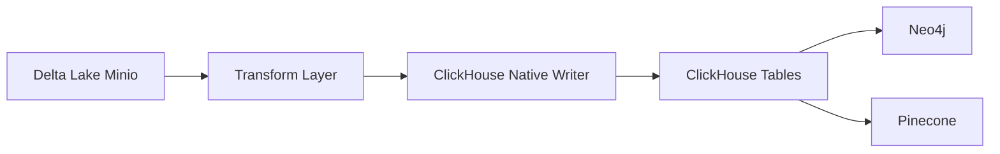

## Overview

ClickHouse serves as the primary **OLAP (Online Analytical Processing)** database in the Entertainment Data Platform, optimized for fast analytical queries on large volumes of entertainment data. It stores denormalized movie, TV series, and person data from the silver layer, enabling high-speed aggregations and filtering operations.

<Info>
ClickHouse is column-oriented, making it ideal for analytical workloads that scan large amounts of data across specific columns.
</Info>

## Architecture

The platform uses a multi-stage pipeline to sync data into ClickHouse:



### Data Flow

<Steps>
  <Step title="Read from Delta Lake">
    Batch jobs read versioned data from Delta Lake tables in MinIO storage, filtering by `batch_version` to ensure incremental updates.
  </Step>
  
  <Step title="Transform for ClickHouse">
    DataFrames are transformed to match ClickHouse schemas, with proper type casting and JSON serialization for nested structures.
  </Step>
  
  <Step title="Write to ClickHouse">
    Data is written using either native ClickHouse connector or JDBC driver, depending on performance requirements.
  </Step>
</Steps>

## Writer Implementations

The platform provides two ClickHouse writer implementations:

### Native Writer

The `ClickHouseNativeWriter` uses the native ClickHouse Spark connector for optimal performance:

```python src/batch_jobs/io/writers/clickhouse_native_writer.py
class ClickHouseNativeWriter:
    def __init__(self, spark: SparkSession):
        self.spark = spark
        self.settings: Settings = load_settings()
        
        self.host = self.settings.storage.clickhouse.host
        self.port = self.settings.storage.clickhouse.port
        self.database = self.settings.storage.clickhouse.database
        self.username = self.settings.storage.clickhouse.username
        self.password = self.settings.storage.clickhouse.password
        self.url = f"jdbc:ch://{self.host}:{self.port}/{self.database}"

    def write_table(self, df: DataFrame, table_name: str):
        """
        Write table to Clickhouse using native connector
        """
        logger.info("Start writing to Clickhouse table: %s.%s", 
                    self.database, table_name)
        df.writeTo(f"clickhouse.{self.database}.{table_name}").append()
        logger.info("Finish writing to Clickhouse table: %s.%s", 
                    self.database, table_name)
```

<Tip>
The native writer uses `writeTo()` API which provides better performance and automatic schema handling compared to JDBC.
</Tip>

### JDBC Writer

The `ClickHouseJdbcWriter` provides a fallback using JDBC connectivity:

```python src/batch_jobs/io/writers/clickhouse_jdbc_writer.py
class ClickHouseJdbcWriter:
    def write_table(self, df: DataFrame, table_name: str, mode: str = "append"):
        """
        Write table to Clickhouse using JDBC
        """
        df.write \
            .format("jdbc") \
            .option("driver", self.driver) \
            .option("url", self.url) \
            .option("user", self.username) \
            .option("password", self.password) \
            .option("isolationLevel", "NONE") \
            .option("dbtable", table_name) \
            .mode(mode) \
            .save()
```

## Table Schemas

ClickHouse stores multiple tables representing different aspects of entertainment data:

<CardGroup cols={2}>
  <Card title="Movie Tables" icon="film">
    - `movie` - Core movie information
    - `movie_cast` - Cast members per movie
    - `movie_crew` - Crew members per movie
  </Card>
  
  <Card title="TV Series Tables" icon="tv">
    - `tv_series` - Core TV series information
    - `tv_series_cast` - Cast members per series
    - `tv_series_crew` - Crew members per series
  </Card>
  
  <Card title="Person Tables" icon="user">
    - `person` - Actor and crew member profiles
  </Card>
</CardGroup>

### Movie Table Schema

The movie table includes both structured and nested data:

```python src/batch_jobs/tranforms/delta_clickhouse/prepare_clickhouse_table.py
def prepare_table_movie(df: DataFrame):
    """
    Convert DataFrame movie to ClickHouse table movie format
    """
    table_df = df.select(
        col("parsed_raw_df.movie_id").cast(LongType()).alias("movie_id"),
        col("parsed_raw_df.movie_detail.original_title").cast(StringType()).alias("original_title"),
        col("parsed_raw_df.movie_detail.overview").cast(StringType()).alias("overview"),
        col("parsed_raw_df.movie_detail.popularity").cast(DoubleType()).alias("popularity"),
        to_date(col("parsed_raw_df.movie_detail.release_date").cast(StringType())).alias("release_date"),
        col("parsed_raw_df.movie_detail.vote_average").cast(DoubleType()).alias("vote_average"),
        col("parsed_raw_df.movie_detail.vote_count").cast(LongType()).alias("vote_count"),
        
        # Nested structures as JSON
        col("parsed_raw_df.movie_detail.genres").alias("genres"),
        col("parsed_raw_df.movie_detail.belongs_to_collection").alias("belongs_to_collection"),
        col("parsed_raw_df.movie_detail.production_countries").alias("production_countries"),
        
        # Change tracking
        col("vector_info_hash").cast(LongType()).alias("vector_info_hash"),
        col("casts_total_hash").cast(LongType()).alias("casts_total_hash"),
        col("crews_total_hash").cast(LongType()).alias("crews_total_hash"),
        col("vector_info_hash_diff").cast(BooleanType()).alias("vector_info_hash_diff"),
        
        # Diff tracking for incremental updates
        to_ch_json(col("casts_diff")).alias("casts_diff"),
        to_ch_json(col("crews_diff")).alias("crews_diff"),
        
        col("batch_version").cast(LongType()).alias("batch_version"),
    )
    return table_df
```

<Note>
Each table includes `batch_version` for incremental processing and hash fields for change detection.
</Note>

## Pipeline: MinIO to ClickHouse

The `minio_to_clickhouse` pipeline syncs data from Delta Lake to ClickHouse:

```python src/batch_jobs/pipelines/silver_silver/minio_to_clickhouse.py
TRANSFORM_MAP = {
    "movie": [
        {"table_name": "movie", "transform_func": prepare_table_movie},
        {"table_name": "movie_cast", "transform_func": prepare_table_movie_cast},
        {"table_name": "movie_crew", "transform_func": prepare_table_movie_crew},
    ],
    "person": [
        {"table_name": "person", "transform_func": prepare_table_person}
    ],
    "tv_series": [
        {"table_name": "tv_series", "transform_func": prepare_table_tv_series},
        {"table_name": "tv_series_cast", "transform_func": prepare_table_tv_series_cast},
        {"table_name": "tv_series_crew", "transform_func": prepare_table_tv_series_crew},
    ]
}

def process_table(
    settings: Settings,
    redis_client: RedisClient,
    delta_minio_reader: DeltaMinioReader,
    clickhouse_writer: ClickHouseNativeWriter,
    transform_map: dict = TRANSFORM_MAP
):
    for data_type, target_folder in settings.storage.delta_lake.target_name_folder:
        # Get batch version from Redis
        version_key = f"{settings.storage.redis.keys.dedup_batch_version}_{data_type}"
        last_version = redis_client.get(version_key)
        
        filters = {"batch_version": int(last_version)}
        
        # Read from Delta Lake
        from_df = delta_minio_reader.read_table_with_filters(
            target_path=from_path, 
            filters=filters
        )
        
        # Transform and write each table
        for table in transform_map[data_type]:
            table_df = table["transform_func"](from_df)
            clickhouse_writer.write_table(df=table_df, table_name=table["table_name"])
```

### Version Management

<Warning>
Batch version tracking via Redis ensures that only new or updated records are processed, preventing duplicate writes and maintaining data consistency.
</Warning>

The pipeline:
1. Retrieves the latest `batch_version` from Redis
2. Filters Delta Lake data for that specific version
3. Transforms data according to ClickHouse schema requirements
4. Writes transformed data to multiple ClickHouse tables

## Query Performance

ClickHouse excels at:

<CardGroup cols={2}>
  <Card title="Aggregations" icon="chart-column">
    Fast `GROUP BY`, `SUM`, `AVG`, `COUNT` operations across millions of records
  </Card>
  
  <Card title="Filtering" icon="filter">
    Efficient `WHERE` clause execution using column-oriented storage
  </Card>
  
  <Card title="Time-series Analysis" icon="clock">
    Optimized date/time range queries for release dates and trending analysis
  </Card>
  
  <Card title="Join Operations" icon="link">
    High-performance joins between movie, cast, and crew tables
  </Card>
</CardGroup>

## Use Cases

### Analytics Queries

ClickHouse powers analytical queries like:

- **Top movies by popularity**: Aggregate vote counts and ratings
- **Genre analysis**: Count movies/series per genre over time
- **Cast/crew analytics**: Identify most prolific actors and directors
- **Release trends**: Time-series analysis of content releases

### Data Export

ClickHouse acts as the source for downstream serving systems:

- **Neo4j**: Graph relationships between movies, series, and people
- **Pinecone**: Vector embeddings for semantic search

## Configuration

ClickHouse connection settings:

```python
settings.storage.clickhouse.host         # ClickHouse server host
settings.storage.clickhouse.port         # Default: 8123 (HTTP) or 9000 (native)
settings.storage.clickhouse.database     # Target database name
settings.storage.clickhouse.username     # Authentication username
settings.storage.clickhouse.password     # Authentication password
settings.storage.clickhouse.jdbc_driver  # JDBC driver class name
```

## Best Practices

<Steps>
  <Step title="Use Native Writer">
    Prefer `ClickHouseNativeWriter` over JDBC for better performance and automatic schema inference.
  </Step>
  
  <Step title="Batch Processing">
    Process data in batches using `batch_version` to manage memory and ensure incremental updates.
  </Step>
  
  <Step title="Type Casting">
    Always cast DataFrame columns to appropriate ClickHouse types (`LongType`, `StringType`, `DoubleType`) before writing.
  </Step>
  
  <Step title="JSON Serialization">
    Use `to_ch_json()` helper for nested structures like arrays and objects to ensure proper format.
  </Step>
  
  <Step title="Error Handling">
    Implement try-catch blocks around write operations and log errors with table names for debugging.
  </Step>
</Steps>

## Related Documentation

<CardGroup cols={2}>
  <Card title="Neo4j" icon="diagram-project" href="/serving/neo4j">
    Learn how ClickHouse feeds graph relationships to Neo4j
  </Card>
  
  <Card title="Pinecone" icon="magnifying-glass" href="/serving/pinecone">
    Discover how ClickHouse data powers vector search
  </Card>
</CardGroup>
