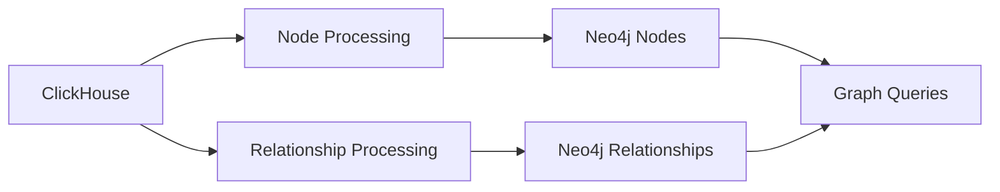

## Overview

Neo4j serves as the **graph database** in the Entertainment Data Platform, modeling complex relationships between movies, TV series, actors, and crew members. It enables powerful graph traversal queries like "find all movies where actors from Movie A also appeared" or "discover career paths of directors."

<Info>
Graph databases excel at relationship queries that would require multiple joins in traditional SQL databases.
</Info>

## Architecture

Neo4j sits downstream from ClickHouse in the data pipeline:



### Data Flow

<Steps>
  <Step title="Read from ClickHouse">
    Batch jobs read denormalized data from ClickHouse tables using `batch_version` filters.
  </Step>
  
  <Step title="Process Nodes">
    Create or update nodes representing movies, TV series, and people with their properties.
  </Step>
  
  <Step title="Process Relationships">
    Join tables to extract relationships like ACTED_IN and WORKS_ON, tracking added/removed connections.
  </Step>
  
  <Step title="Write to Neo4j">
    Use Neo4j Spark connector to write nodes and relationships with batching for performance.
  </Step>
</Steps>

## Writer Implementation

The `Neo4jWriter` class handles all writes to the graph database:

```python src/batch_jobs/io/writers/neo4j_writer.py
class Neo4jWriter:
    def __init__(self, spark: SparkSession):
        self.spark = spark
        self.settings = load_settings()
```

### Writing Nodes

Neo4j nodes represent entities in the entertainment graph:

#### Strict Constraint Mode

Used when node keys must be unique (KEY constraint):

```python src/batch_jobs/io/writers/neo4j_writer.py
def write_node_constraint(self, df: DataFrame, label: str, keys: list[str]):
    """
    Write Node to Neo4j with strict constraint
    :param df: DataFrame to write
    :param label: Label of Node (e.g., "Movie", "Person")
    :param keys: Keys of Node (e.g., ["movie_id"])
    """
    logger.info("Start writing Node (strict mode) to Neo4j with label: %s", label)
    
    format_label = f":{label}"
    format_keys = ",".join(keys)
    
    df.write.format("org.neo4j.spark.DataSource") \
        .mode("Overwrite") \
        .option("labels", format_label) \
        .option("node.keys", format_keys) \
        .option("schema.optimization.node.keys", "KEY") \
        .option("schema.optimization", "TYPE") \
        .option("batch.size", self.settings.storage.neo4j.batch_size) \
        .save()
```

<Note>
`schema.optimization.node.keys = "KEY"` enforces uniqueness constraints at the database level, ensuring data integrity.
</Note>

#### Normal Mode

Used for nodes with UNIQUE constraints (allows nulls):

```python src/batch_jobs/io/writers/neo4j_writer.py
def write_node_normal(self, df: DataFrame, label: str, keys: list[str]):
    """
    Write Node to Neo4j with normal constraint
    """
    format_label = f":{label}"
    format_keys = ",".join(keys)
    
    df.write.format("org.neo4j.spark.DataSource") \
        .mode("Overwrite") \
        .option("labels", format_label) \
        .option("node.keys", format_keys) \
        .option("schema.optimization.node.keys", "UNIQUE") \
        .option("node.keys.skip.nulls", "true") \
        .option("schema.optimization", "TYPE") \
        .option("batch.size", self.settings.storage.neo4j.batch_size) \
        .save()
```

<Tip>
`node.keys.skip.nulls = "true"` prevents errors when key fields contain null values.
</Tip>

### Writing Relationships

Relationships connect nodes in the graph:

```python src/batch_jobs/io/writers/neo4j_writer.py
def write_relationship(
    self,
    df: DataFrame,
    repartition_cols: list[str],
    relationship: str,
    source_label: str,
    source_keys: list[str],
    source_properties: list[str],
    target_label: str,
    target_keys: list[str],
    target_properties: list[str],
    relationship_properties: list[str],
    partition_num: int = 1,
    action_col: str = "added"
):
    """
    Write Relationship to Neo4j
    :param relationship: Relationship name (e.g., "ACTED_IN", "WORKS_ON")
    :param action_col: Action column name in diff ("added" or "removed")
    """
    is_deleted_action = True if action_col == "removed" else False
    
    # Add deletion flag
    enriched_df = df.withColumn("is_deleted", lit(is_deleted_action))
    repartition_df = enriched_df.repartition(partition_num, *repartition_cols)
    
    repartition_df.write.format("org.neo4j.spark.DataSource") \
        .mode("Overwrite") \
        .option("relationship", relationship) \
        .option("relationship.save.strategy", "keys") \
        .option("relationship.source.save.mode", "Overwrite") \
        .option("relationship.source.labels", f":{source_label}") \
        .option("relationship.source.node.keys", ",".join(source_keys)) \
        .option("relationship.source.node.properties", ",".join(source_properties)) \
        .option("relationship.target.save.mode", "Overwrite") \
        .option("relationship.target.labels", f":{target_label}") \
        .option("relationship.target.node.keys", ",".join(target_keys)) \
        .option("relationship.target.node.properties", ",".join(target_properties)) \
        .option("relationship.properties", ",".join(relationship_properties + ["is_deleted"])) \
        .option("batch.size", self.settings.storage.neo4j.batch_size) \
        .save()
```

<Warning>
The `is_deleted` flag marks relationships as removed without physical deletion, enabling temporal graph queries.
</Warning>

## Graph Schema

The Entertainment Data Platform models this graph structure:

### Node Types

<CardGroup cols={3}>
  <Card title="Movie" icon="film">
    Properties: `movie_id`, `original_title`, `overview`, `popularity`, `release_date`, `tagline`, `vote_average`, `vote_count`, `batch_version`
  </Card>
  
  <Card title="Person" icon="user">
    Properties: `person_id`, `name`, `gender`, `also_known_as`, `biography`, `birthday`, `deathday`, `place_of_birth`, `known_for_department`, `batch_version`
  </Card>
  
  <Card title="TV_Series" icon="tv">
    Properties: `tv_series_id`, `overview`, `popularity`, `first_air_date`, `tagline`, `vote_average`, `vote_count`, `status`, `number_of_seasons`, `batch_version`
  </Card>
</CardGroup>

### Relationship Types

<CardGroup cols={2}>
  <Card title="ACTED_IN" icon="masks-theater">
    `(Person)-[ACTED_IN]->(Movie|TV_Series)`
    
    Properties: `cast_id`, `character`, `credit_id`, `known_for_department`, `batch_version`, `is_deleted`
  </Card>
  
  <Card title="WORKS_ON" icon="briefcase">
    `(Person)-[WORKS_ON]->(Movie|TV_Series)`
    
    Properties: `department`, `job`, `known_for_department`, `batch_version`, `is_deleted`
  </Card>
</CardGroup>

## Pipeline: ClickHouse to Neo4j

The `clickhouse_to_neo4j` pipeline syncs graph data:

```python src/batch_jobs/pipelines/silver_gold/clickhouse_to_neo4j.py
TRANSFORM_MAP = {
    "nodes": {
        "movie": {
            "label": "Movie", 
            "keys": ["movie_id"],
            "select_cols": ["movie_id", "original_title", "overview", 
                            "popularity", "release_date", "tagline",
                            "vote_average", "vote_count", "batch_version"],
        },
        "person": {
            "label": "Person", 
            "keys": ["person_id"],
            "select_cols": ["person_id", "name", "gender", "also_known_as", 
                            "biography", "birthday", "deathday",
                            "place_of_birth", "known_for_department", 
                            "batch_version"],
        },
        "tv_series": {
            "label": "TV_Series", 
            "keys": ["tv_series_id"],
            "select_cols": ["tv_series_id", "overview", "popularity", 
                            "first_air_date", "tagline", "vote_average",
                            "vote_count", "status", "number_of_seasons", 
                            "batch_version"],
        },
    },
    "relationships": [
        {
            "ACTED_IN": {
                "tables": [["movie", "movie_cast"], ["tv_series", "tv_series_cast"]],
                "diff_col": ["casts_diff", "casts_diff"],
                "action_col": [["added", "removed"], ["added", "removed"]],
                "source_label": ["Person", "Person"],
                "source_keys": [["person_id"], ["person_id"]],
                "target_label": ["Movie", "TV_Series"],
                "target_keys": [["movie_id"], ["tv_series_id"]],
                "relationship_properties": [
                    ["cast_id", "character", "credit_id", 
                     "known_for_department", "batch_version"],
                    ["cast_id", "character", "credit_id", 
                     "known_for_department", "batch_version"]
                ],
            }
        },
        {
            "WORKS_ON": {
                "tables": [["movie", "movie_crew"], ["tv_series", "tv_series_crew"]],
                "diff_col": ["crews_diff", "crews_diff"],
                "action_col": [["added", "removed"], ["added", "removed"]],
                "source_label": ["Person", "Person"],
                "target_label": ["Movie", "TV_Series"],
                "relationship_properties": [
                    ["department", "job", "known_for_department", "batch_version"],
                    ["department", "job", "known_for_department", "batch_version"]
                ],
            }
        },
    ]
}
```

### Node Processing

```python src/batch_jobs/pipelines/silver_gold/clickhouse_to_neo4j.py
def process_nodes(
    transform_map: dict,
    settings: Settings,
    redis_client: RedisClient,
    clickhouse_reader: ClickHouseReader,
    neo4j_writer: Neo4jWriter
):
    for table_name, config in transform_map["nodes"].items():
        label = config["label"]
        keys = config["keys"]
        select_cols = config["select_cols"]
        
        # Get batch version from Redis
        version_key = f"{settings.storage.redis.keys.dedup_batch_version}_{table_name}"
        last_version = redis_client.get(version_key)
        
        # Read from ClickHouse
        filters = [{"batch_version": int(last_version)}]
        table_reader = clickhouse_reader.read_table_with_filters(
            table_name=table_name, 
            filters=filters
        ).select(*select_cols)
        
        # Write to Neo4j
        neo4j_writer.write_node_constraint(df=table_reader, label=label, keys=keys)
```

### Relationship Processing

Relationships are extracted by joining main tables with cast/crew tables:

```python src/batch_jobs/pipelines/silver_gold/clickhouse_to_neo4j.py
def process_relationships(
    transform_map: dict,
    settings: Settings,
    redis_client: RedisClient,
    clickhouse_reader: ClickHouseReader,
    neo4j_writer: Neo4jWriter
):
    for rel in transform_map["relationships"]:
        for relationship, config in rel.items():
            # Read both tables from ClickHouse
            left_df = clickhouse_reader.read_table_with_filters(
                table_name=tables[0], 
                filters=filters
            )
            right_df = clickhouse_reader.read_table_with_filters(
                table_name=tables[1], 
                filters=filters
            )
            
            # Process both "added" and "removed" actions
            for action in ["added", "removed"]:
                join_df = join_to_get_relationship(
                    left_df=left_df,
                    right_df=right_df,
                    key_cols=target_keys,
                    diff_col=diff_col,
                    action_col=action,
                    id_col_in_diff=id_col_in_diff,
                    relationship_properties=relationship_properties
                )
                
                # Write relationship with deletion tracking
                neo4j_writer.write_relationship(
                    df=join_df,
                    relationship=relationship,
                    source_label=source_label,
                    target_label=target_label,
                    # ... other parameters
                    action_col=action
                )
```

<Info>
The pipeline processes both "added" and "removed" changes from diff columns, maintaining a temporal view of relationships.
</Info>

## Graph Query Examples

### Find Actor's Filmography

```cypher
MATCH (p:Person {name: "Tom Hanks"})-[r:ACTED_IN]->(m:Movie)
WHERE r.is_deleted = false
RETURN m.original_title, r.character, m.release_date
ORDER BY m.release_date DESC
```

### Discover Collaborations

```cypher
MATCH (p1:Person)-[r1:ACTED_IN]->(m:Movie)<-[r2:ACTED_IN]-(p2:Person)
WHERE p1.name = "Leonardo DiCaprio" 
  AND r1.is_deleted = false 
  AND r2.is_deleted = false
RETURN DISTINCT p2.name, COUNT(m) as collaborations
ORDER BY collaborations DESC
LIMIT 10
```

### Find Director's Works

```cypher
MATCH (p:Person)-[r:WORKS_ON]->(m:Movie)
WHERE p.name = "Christopher Nolan" 
  AND r.job = "Director"
  AND r.is_deleted = false
RETURN m.original_title, m.release_date, m.vote_average
ORDER BY m.release_date DESC
```

## Performance Optimization

<Steps>
  <Step title="Batch Size Tuning">
    Configure `settings.storage.neo4j.batch_size` to balance throughput and memory usage. Typical values: 500-5000.
  </Step>
  
  <Step title="Repartitioning">
    Use `repartition()` before writing relationships to distribute load evenly across Spark executors.
  </Step>
  
  <Step title="Index Creation">
    Ensure Neo4j indexes exist on node keys (`movie_id`, `person_id`, `tv_series_id`) for fast lookups.
  </Step>
  
  <Step title="Connection Pooling">
    Neo4j Spark connector automatically manages connection pooling for optimal performance.
  </Step>
</Steps>

## Use Cases

<CardGroup cols={2}>
  <Card title="Recommendation Engines" icon="star">
    "Users who liked this movie also liked..." queries using graph traversal
  </Card>
  
  <Card title="Career Analysis" icon="chart-line">
    Analyze career trajectories of actors and directors over time
  </Card>
  
  <Card title="Network Discovery" icon="project-diagram">
    Find hidden connections between industry professionals
  </Card>
  
  <Card title="Influence Mapping" icon="sitemap">
    Identify key influencers based on collaboration networks
  </Card>
</CardGroup>

## Configuration

Neo4j connection settings:

```python
settings.storage.neo4j.uri          # Neo4j bolt:// connection URI
settings.storage.neo4j.username     # Authentication username
settings.storage.neo4j.password     # Authentication password
settings.storage.neo4j.batch_size   # Write batch size (default: 1000)
```

## Best Practices

<Steps>
  <Step title="Use Constraint Mode">
    Prefer `write_node_constraint()` for entity nodes to enforce uniqueness.
  </Step>
  
  <Step title="Track Deletions">
    Always include `is_deleted` flag in relationships for temporal queries.
  </Step>
  
  <Step title="Batch Version Filtering">
    Filter data by `batch_version` to process only recent changes.
  </Step>
  
  <Step title="Explicit Property Selection">
    Use `select_cols` to limit properties written to Neo4j, reducing storage.
  </Step>
  
  <Step title="Handle Action Columns">
    Process both "added" and "removed" actions from diff columns separately.
  </Step>
</Steps>

## Related Documentation

<CardGroup cols={2}>
  <Card title="ClickHouse" icon="database" href="/serving/clickhouse">
    Learn how ClickHouse feeds data to Neo4j
  </Card>
  
  <Card title="Pinecone" icon="magnifying-glass" href="/serving/pinecone">
    Compare graph queries with vector search capabilities
  </Card>
</CardGroup>
