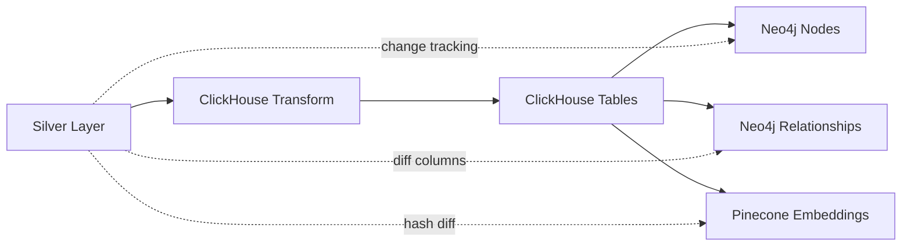

## Overview

The Gold Layer represents **business-ready, use-case-optimized data** prepared for specific consumption patterns. It transforms Silver Layer data into specialized formats for OLAP analytics (ClickHouse), knowledge graph queries (Neo4j), and semantic search (Pinecone).

<Info>
The Gold Layer is where the single source of truth (Silver) diverges into multiple specialized representations, each optimized for its specific access pattern.
</Info>

## Purpose and Design

The Gold Layer serves three distinct downstream systems:

- **ClickHouse (OLAP)**: Normalized tables for fast analytical queries
- **Neo4j (Graph)**: Nodes and relationships for entity exploration
- **Pinecone (Vector)**: Embeddings for semantic search and RAG

Each system receives data in its optimal format while maintaining consistency through the shared Silver foundation.

## Architecture Overview

<Steps>
  <Step title="Silver to ClickHouse">
    Transform nested Silver data into normalized relational tables
  </Step>
  <Step title="ClickHouse to Neo4j">
    Build graph nodes and relationships with intelligent change tracking
  </Step>
  <Step title="ClickHouse to Pinecone">
    Generate embeddings and sync to vector database
  </Step>
</Steps>

<Note>
ClickHouse acts as an intermediate layer for Neo4j and Pinecone, providing fast filtered reads and avoiding repeated Silver table scans.
</Note>

## Gold Layer: ClickHouse (Analytics)

### Purpose

ClickHouse tables provide ultra-fast OLAP capabilities for:

- Statistical reporting and dashboards
- Ad-hoc analytical queries
- Data exports and business intelligence
- Intermediate source for Graph and Vector syncs

### Data Transformation

The pipeline from `batch_jobs/pipelines/silver_silver/minio_to_clickhouse.py`:

```python
TRANSFORM_MAP = {
    "movie": [
        {"table_name": "movie", "transform_func": prepare_table_movie},
        {"table_name": "movie_cast", "transform_func": prepare_table_movie_cast},
        {"table_name": "movie_crew", "transform_func": prepare_table_movie_crew},
    ],
    "person": [
        {"table_name": "person", "transform_func": prepare_table_person}
    ],
    "tv_series": [
        {"table_name": "tv_series", "transform_func": prepare_table_tv_series},
        {"table_name": "tv_series_cast", "transform_func": prepare_table_tv_series_cast},
        {"table_name": "tv_series_crew", "transform_func": prepare_table_tv_series_crew},
    ]
}

def process_table(
        settings: Settings,
        redis_client: RedisClient,
        delta_minio_reader: DeltaMinioReader,
        clickhouse_writer: ClickHouseNativeWriter,
        transform_map: dict = TRANSFORM_MAP
):
    for data_type, target_folder in settings.storage.delta_lake.target_name_folder:
        # Get batch version from Redis
        version_key = f"{settings.storage.redis.keys.dedup_batch_version}_{data_type}"
        last_version = redis_client.get(version_key)
        
        # Read only the latest batch from Silver
        filters = {"batch_version": int(last_version)}
        from_df = delta_minio_reader.read_table_with_filters(
            target_path=from_path, 
            filters=filters
        )
        
        # Transform and write each table
        for table in table_list:
            table_name = table["table_name"]
            transform_func = table["transform_func"]
            table_df = transform_func(from_df)
            clickhouse_writer.write_table(df=table_df, table_name=table_name)
```

### Table Structure

Silver's nested data is denormalized into separate tables:

<CardGroup cols={3}>
  <Card title="Core Entities" icon="database">
    - `movie`
    - `tv_series`
    - `person`
  </Card>
  <Card title="Cast Relationships" icon="users">
    - `movie_cast`
    - `tv_series_cast`
  </Card>
  <Card title="Crew Relationships" icon="film">
    - `movie_crew`
    - `tv_series_crew`
  </Card>
</CardGroup>

### Incremental Updates

<Tip>
Only records from the latest batch are written to ClickHouse, leveraging the `batch_version` column added in the Silver Layer.
</Tip>

ClickHouse tables use `ReplacingMergeTree` engine to handle upserts efficiently:

```sql
CREATE TABLE movie (
    movie_id Int64,
    original_title String,
    overview String,
    popularity Float64,
    release_date Date,
    tagline String,
    vote_average Float64,
    vote_count Int32,
    batch_version Int64
)
ENGINE = ReplacingMergeTree(batch_version)
PARTITION BY toYYYYMM(release_date)
ORDER BY movie_id;
```

## Gold Layer: Neo4j (Knowledge Graph)

### Purpose

Neo4j enables relationship-based queries like:

- "Find all actors who worked with a specific director"
- "Discover movies with overlapping cast members"
- "Trace career paths of actors across TV and film"

### Graph Schema

<CardGroup cols={2}>
  <Card title="Nodes" icon="circle-nodes">
    - Movie
    - TV_Series
    - Person
  </Card>
  <Card title="Relationships" icon="diagram-project">
    - ACTED_IN
    - WORKS_ON
  </Card>
</CardGroup>

### Intelligent Sync Strategy

Neo4j syncing from `batch_jobs/pipelines/silver_gold/clickhouse_to_neo4j.py`:

```python
TRANSFORM_MAP = {
    "nodes": {
        "movie": {
            "label": "Movie", 
            "keys": ["movie_id"],
            "select_cols": ["movie_id", "original_title", "overview", 
                           "popularity", "release_date", "tagline",
                           "vote_average", "vote_count", "batch_version"],
        },
        "person": {
            "label": "Person", 
            "keys": ["person_id"],
            "select_cols": ["person_id", "name", "gender", "biography", 
                           "birthday", "known_for_department", "batch_version"],
        },
        "tv_series": {
            "label": "TV_Series", 
            "keys": ["tv_series_id"],
            "select_cols": ["tv_series_id", "overview", "popularity", 
                           "first_air_date", "vote_average", "batch_version"],
        },
    },
    "relationships": [
        {
            "ACTED_IN": {
                "tables": [["movie", "movie_cast"], ["tv_series", "tv_series_cast"]],
                "diff_col": ["casts_diff", "casts_diff"],
                "action_col": [["added", "removed"], ["added", "removed"]],
                "id_col_in_diff": ["person_id", "person_id"],
                "source_label": ["Person", "Person"],
                "target_label": ["Movie", "TV_Series"],
                "relationship_properties": [
                    ["cast_id", "character", "credit_id", "batch_version"],
                    ["cast_id", "character", "credit_id", "batch_version"]
                ],
            }
        },
    ]
}
```

### Change-Driven Updates

The system leverages Silver Layer change tracking for efficient graph updates:

```python
def process_relationships(
        transform_map: dict,
        settings: Settings,
        redis_client: RedisClient,
        clickhouse_reader: ClickHouseReader,
        neo4j_writer: Neo4jWriter
):
    for rel in transform_map["relationships"]:
        for relationship, config in rel.items():
            # Read from ClickHouse with batch filter
            version_key = f"{settings.storage.redis.keys.dedup_batch_version}_{tables[0]}"
            last_version = redis_client.get(version_key)
            filters = [{"batch_version": int(last_version)}]
            
            left_df = clickhouse_reader.read_table_with_filters(
                table_name=tables[0], filters=filters
            )
            right_df = clickhouse_reader.read_table_with_filters(
                table_name=tables[1], filters=filters
            )
            
            # Process both added and removed relationships
            for action in ["added", "removed"]:
                join_df = join_to_get_relationship(
                    left_df=left_df,
                    right_df=right_df,
                    key_cols=target_keys,
                    diff_col=diff_col,
                    action_col=action,
                    id_col_in_diff=id_col_in_diff,
                    relationship_properties=relationship_properties
                )
                
                neo4j_writer.write_relationship(
                    df=join_df,
                    relationship=relationship,
                    source_label=source_label,
                    source_keys=source_keys,
                    target_label=target_label,
                    target_keys=target_keys,
                    relationship_properties=relationship_properties
                )
```

<Warning>
**Critical Efficiency**: By using `casts_diff.added` and `casts_diff.removed` from Silver, only changed relationships are written to Neo4j, avoiding expensive full-graph rebuilds.
</Warning>

### Node Upsert Strategy

Nodes use MERGE with constraints:

```python
def write_node_constraint(self, df: DataFrame, label: str, keys: list):
    """
    Write nodes with unique key constraints
    """
    # Example Cypher generated:
    # MERGE (n:Movie {movie_id: $movie_id})
    # ON CREATE SET n += $properties
    # ON MATCH SET n += $properties
```

### Relationship Update Pattern

<Steps>
  <Step title="Filter by batch_version">
    Read only entities modified in latest Silver batch
  </Step>
  <Step title="Extract diff columns">
    Get lists of added/removed relationship IDs
  </Step>
  <Step title="Join with details">
    Enrich with full cast/crew properties from ClickHouse
  </Step>
  <Step title="Upsert relationships">
    MERGE for additions, DELETE for removals
  </Step>
</Steps>

## Gold Layer: Pinecone (Vector Search)

### Purpose

Pinecone enables semantic search and RAG applications:

- "Find movies similar to this description"
- "Recommend content based on user preferences"
- "Generate AI responses grounded in entertainment data"

### Embedding Generation

The pipeline from `batch_jobs/pipelines/silver_gold/clickhouse_to_pinecone.py`:

```python
TRANSFORM_MAP = {
    "movie": {
        "id_col": "movie_id",
        "vector_prepare_cols": ["overview", "tagline"],
        "vector_col_name": "document",
        "metadata": "{}"
    },
    "tv_series": {
        "id_col": "tv_series_id",
        "vector_prepare_cols": ["overview", "tagline"],
        "vector_col_name": "document",
        "metadata": "{}"
    },
}

def write_clickhouse_to_pinecone(transform_map=TRANSFORM_MAP):
    spark = builder.getOrCreate()
    clickhouse_reader = ClickHouseReader(spark)
    pinecone_writer = PineconeWriter(spark)
    
    for table_name, config in transform_map.items():
        # Get batch version
        version_key = f"{settings.storage.redis.keys.dedup_batch_version}_{table_name}"
        last_version = redis_client.get(version_key)
        
        # Read latest batch from ClickHouse
        filters = [{"batch_version": int(last_version)}]
        table_reader = clickhouse_reader.read_table_with_filters(
            table_name=table_name, 
            filters=filters
        )
        
        # Generate embeddings
        vector_df = prepare_vector_schema(
            df=table_reader,
            id_col=config["id_col"],
            namespace=settings.storage.pinecone.namespace.model_dump()[table_name],
            model_name="intfloat/e5-large-v2",
            vector_prepare_cols=config["vector_prepare_cols"],
            vector_col_name=config["vector_col_name"],
            metadata=config["metadata"]
        )
        
        # Write to Pinecone
        pinecone_writer.write_index(vector_df)
```

### Change-Driven Embedding Updates

<Info>
**Efficiency**: The Silver Layer's `vector_info_hash_diff` column indicates when embedding-related fields changed. Only records with `vector_info_hash_diff = true` need re-embedding.
</Info>

This optimization significantly reduces:

- Embedding computation costs (API calls to sentence-transformers)
- Vector upsert volume to Pinecone
- Pipeline execution time

### Embedding Model

The platform uses `intfloat/e5-large-v2` for high-quality semantic embeddings:

- **Input**: Concatenated overview + tagline text
- **Output**: 1024-dimensional dense vectors
- **Use cases**: Similarity search, recommendation, RAG retrieval

### Namespace Organization

Pinecone indexes are organized by entity type:

```
Pinecone Index: entertainment-data
├── Namespace: movies
│   └── Vectors with movie_id as key
└── Namespace: tv_series
    └── Vectors with tv_series_id as key
```

## Data Flow Summary



<Note>
Dotted lines indicate metadata flow: Silver Layer change tracking drives efficient updates to Neo4j and Pinecone.
</Note>

## Batch Version Coordination

All Gold Layer pipelines synchronize using Redis-tracked batch versions:

<Steps>
  <Step title="Silver Layer Completes">
    Bronze-to-Silver pipeline writes new `batch_version` to Silver tables
  </Step>
  <Step title="Version Stored in Redis">
    Latest `batch_version` for each entity type stored in Redis
  </Step>
  <Step title="Gold Pipelines Read Version">
    ClickHouse, Neo4j, and Pinecone pipelines query Redis for latest version
  </Step>
  <Step title="Filter by Version">
    Each pipeline processes only records matching current `batch_version`
  </Step>
</Steps>

This ensures all downstream systems stay synchronized without race conditions.

## Performance Characteristics

<CardGroup cols={3}>
  <Card title="ClickHouse" icon="gauge-high">
    Columnar storage enables sub-second aggregation queries over millions of rows
  </Card>
  <Card title="Neo4j" icon="diagram-project">
    Index-free adjacency provides constant-time traversals regardless of graph size
  </Card>
  <Card title="Pinecone" icon="magnifying-glass">
    Approximate nearest neighbor search returns top-k results in milliseconds
  </Card>
</CardGroup>

## Query Patterns

### ClickHouse Analytics

```sql
-- Top 10 movies by average vote in 2023
SELECT original_title, vote_average, vote_count
FROM movie
WHERE toYear(release_date) = 2023 AND vote_count > 100
ORDER BY vote_average DESC
LIMIT 10;

-- Actor collaboration analysis
SELECT 
    p.name,
    COUNT(DISTINCT mc.movie_id) as movie_count,
    AVG(m.vote_average) as avg_rating
FROM person p
JOIN movie_cast mc ON p.person_id = mc.person_id
JOIN movie m ON mc.movie_id = m.movie_id
GROUP BY p.name
HAVING movie_count > 5
ORDER BY avg_rating DESC;
```

### Neo4j Graph Traversal

```cypher
// Find actors who worked with Christopher Nolan
MATCH (director:Person {name: "Christopher Nolan"})-[:WORKS_ON]->(m:Movie)<-[:ACTED_IN]-(actor:Person)
RETURN DISTINCT actor.name, COUNT(m) as collaborations
ORDER BY collaborations DESC;

// Discover movie similarity by shared cast
MATCH (m1:Movie {movie_id: 12345})<-[:ACTED_IN]-(actor:Person)-[:ACTED_IN]->(m2:Movie)
WHERE m1 <> m2
RETURN m2.original_title, COUNT(actor) as shared_actors
ORDER BY shared_actors DESC
LIMIT 10;
```

### Pinecone Semantic Search

```python
# Find similar movies by embedding
query_embedding = model.encode("A thrilling space adventure with AI")
results = index.query(
    vector=query_embedding,
    namespace="movies",
    top_k=10,
    include_metadata=True
)

for match in results.matches:
    print(f"{match.id}: {match.score}")
```

## Monitoring and Operations

### Key Metrics

- **ClickHouse insert rate**: Rows per second written
- **Neo4j relationship updates**: Merge operations per batch
- **Pinecone embedding generation**: Vectors created per minute
- **Sync lag**: Time between Silver update and Gold availability

### Optimization Strategies

<CardGroup cols={2}>
  <Card title="ClickHouse" icon="database">
    - Partition by time dimensions
    - Use appropriate MergeTree engine
    - Optimize ORDER BY columns
  </Card>
  <Card title="Neo4j" icon="diagram-project">
    - Create indexes on node keys
    - Batch relationship writes
    - Use APOC procedures for bulk ops
  </Card>
  <Card title="Pinecone" icon="cloud">
    - Batch upserts in groups of 100
    - Use async writes for throughput
    - Monitor index statistics
  </Card>
  <Card title="General" icon="gears">
    - Process only changed records
    - Parallelize independent writes
    - Monitor batch version lag
  </Card>
</CardGroup>

## Cost Optimization

<Tip>
The change tracking system dramatically reduces operational costs by avoiding unnecessary updates to Neo4j (graph operations) and Pinecone (embedding API calls + storage).
</Tip>

### Cost Breakdown

**Without Change Tracking**:
- Every batch: Re-embed all records → High API costs
- Every batch: Rebuild all relationships → High graph write costs

**With Change Tracking**:
- Only changed content → Minimal API calls
- Only modified relationships → Targeted graph updates
- **Estimated savings**: 80-95% reduction in downstream writes

## Next Steps

<Card title="Delta Lake Deep Dive" icon="database" href="/storage/delta-lake">
  Explore Delta Lake features powering the entire storage architecture
</Card>